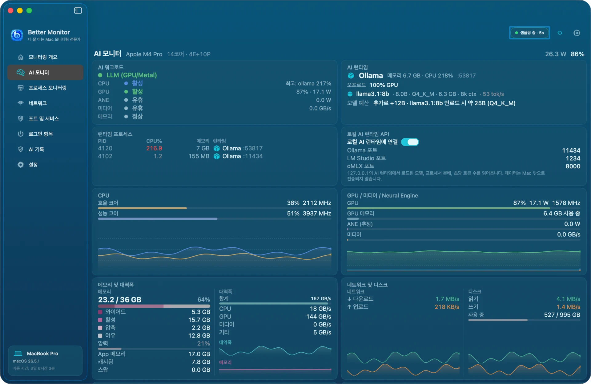

# Better Monitor

[English](README.md) · [简体中文](README.zh-CN.md) · [日本語](README.ja.md) · 한국어


지금 Mac에서 무슨 일이 일어나고 있는지 파악할 수 있는 네이티브 macOS 시스템 모니터입니다.

Better Monitor는 프로세스, 네트워크, 포트, 로그인 항목, 하드웨어 정보를 하나의 앱에 모아, 평소 상태 확인과 문제 추적 모두에 쓸 수 있습니다.


## 이럴 때 사용하세요

- CPU, 메모리, 디스크, 네트워크, 배터리, 센서, 프로세스 상태를 한 번에 확인하고 싶을 때
- CPU나 메모리를 비정상적으로 많이 쓰는 앱이나 프로세스를 찾고 싶을 때
- 활성 네트워크 연결, 트래픽, 프로토콜, 연결 대상을 확인하고 싶을 때
- 수신 중인 포트와 그 소유 프로세스, 위험 신호를 확인하고 싶을 때
- 백그라운드에서 자동 실행되는 항목과 현재 리소스 영향을 확인하고 싶을 때
- Ollama, LM Studio, MLX로 실행 중인 로컬 모델이 GPU와 Neural Engine 중 어디에서 도는지 메모리 대역폭, 초당 토큰 수와 함께 확인하고 싶을 때

## 빠른 시작

1. Better Monitor를 설치합니다.

   ```bash
   brew install --cask bettermacnet/tap/better-monitor
   ```

2. Better Monitor를 실행하고 사이드바에서 화면을 선택합니다.
3. 상태를 빠르게 보려면 「모니터링 개요」를, Apple 실리콘 하드웨어와 로컬 AI 런타임을 보려면 「AI 모니터」를, 특정 문제를 살펴보려면 프로세스 모니터링, 네트워크, 포트 및 서비스, 로그인 항목을 여세요.
4. 현재 Wi-Fi 이름을 보고 싶을 때만 위치 서비스를 허용하세요. 권한과 시스템 공개 범위에 따라 macOS가 프로세스와 포트의 세부 정보를 제한할 수 있습니다.

[최신 릴리스](https://github.com/BetterMacNet/better-monitor/releases/latest)에서 디스크 이미지를 내려받아 `Better Monitor.app`을 「응용 프로그램」 폴더로 옮겨도 됩니다. 릴리스는 Developer ID로 서명되고 Apple의 공증을 받았으며, 공증 티켓이 디스크 이미지에 스테이플되어 있습니다.

## 주요 기능

- **모니터링 개요** — 시스템 상태와 주요 리소스 정보를 한눈에 확인합니다.
- **AI 모니터** — Apple 실리콘을 자세히 확인합니다. CPU 클러스터, GPU, Neural Engine, 미디어 엔진, 메모리 대역폭, 전력, 센서와 함께 Ollama, LM Studio, MLX 같은 로컬 AI 런타임의 로드된 모델과 초당 토큰 수를 보여 줍니다.
- **프로세스 모니터링** — 리소스 사용량, 식별 정보, 경로, 네트워크 활동, 열린 파일을 확인하고, 제어할 수 있는 프로세스에는 작업을 실행합니다.
- **네트워크 활동** — 인터페이스, 연결, 트래픽, 프로토콜, TCP 상태, 연결 대상을 확인합니다.
- **포트 및 서비스** — 수신 포트와 소유 프로세스를 찾고, 유용한 위험 신호를 보여 줍니다.
- **로그인 항목** — 읽을 수 있는 LaunchAgents와 LaunchDaemons, 현재 리소스 영향을 확인하고, macOS가 관리하는 로그인 항목은 시스템 설정에서 검토합니다.
- **선택형 AI 도우미** — 직접 AI 서비스를 설정하고, 필요할 때 프로세스 AI 진단을 요청합니다.
- **네이티브 macOS 경험** — SwiftUI로 만들었으며 macOS 15 이상을 지원합니다.

[사용 설명서](docs/usage.ko.md)에서 모든 화면을 스크린샷과 함께 안내합니다.

## 스크린샷



**AI 모니터** — 로컬 모델이 어떤 엔진에서 실행되고 무엇에 제한되는지 CPU 클러스터부터 메모리 대역폭까지 확인합니다

| | |
|---|---|
|  |  |
| **프로세스 모니터링** — CPU, 메모리, 리소스 영향으로 정렬. 목록, 집계, 트리 세 가지 보기 | **프로세스 세부정보** — 식별 정보, 서명, 열린 파일, 선택형 AI 요약 |
|  |  |
| **네트워크 활동** — 실시간 처리량과 연결별 프로세스, TCP 상태 | **포트 및 서비스** — 누가 어떤 주소에서 수신 중인지, 어떤 바인딩을 확인해야 하는지 |
|  |  |
| **로그인 항목** — 로그인 항목, LaunchAgents, LaunchDaemons와 현재 영향, 서명 | **라이트와 다크** — 시스템 설정을 따르거나 직접 선택. 인터페이스는 4개 언어 지원 |

스크린샷은 데모 데이터로 만들었습니다. 기기 이름, 경로, 주소는 가상의 값입니다.

## 권한과 알려진 제한

- 현재 Wi-Fi 이름을 보려면 위치 서비스 권한이 필요합니다. Better Monitor는 이 권한을 위치 확인에 사용하지 않습니다.
- 시스템이 앱에 공개하지 않는 경우 프로세스와 포트의 세부 정보가 제한될 수 있습니다.
- macOS가 관리하는 로그인 항목은 앱에서 완전히 관리하지 않고 시스템 설정에서 검토합니다.
- 비로컬 바인딩은 확인해 볼 신호이며, 외부에서 접근할 수 있다는 증거나 보안 감사를 마쳤다는 뜻이 아닙니다.
- 로그인 항목의 영향은 현재 실행 상태를 기준으로 한 값이며, 부팅 시간 측정도 아니고 사용 중지 후 리소스 절약을 보장하지도 않습니다.

## 개인정보 보호와 선택형 AI

기본 모니터링은 로컬에서 이루어지며 계정이나 클라우드 서비스가 필요하지 않습니다. AI 도우미는 선택 사항입니다.

- AI 진단은 AI 서비스를 설정하고 직접 요약을 요청했을 때만 네트워크를 사용합니다.
- API 키는 macOS 키체인에 저장됩니다.
- 진단 정보를 보내기 전에 데이터 전송 안내가 표시됩니다.
- 요청에는 진단에 필요한 프로세스, 네트워크, 경로, 파일 활동 요약이 포함될 수 있습니다. 사용하기 전에 서비스 제공자의 데이터 처리 방식을 확인하세요.
- 앱 안의 로컬 AI 대화와 모니터링 기록은 지울 수 있습니다. 지워도 이미 서비스 제공자에게 보낸 데이터는 삭제되지 않습니다.
- 진단을 위해 보낸 데이터에는 서비스 제공자의 보관 및 모델 학습 약관이 적용됩니다.

AI를 설정하지 않아도 기본 모니터링 기능은 모두 쓸 수 있습니다.

## 문서와 지원

- [사용 설명서](docs/usage.ko.md)
- [릴리스 노트(영어)](docs/release-notes.en.md)
- [최신 릴리스](https://github.com/BetterMacNet/better-monitor/releases/latest)
- [버그 신고](https://github.com/BetterMacNet/better-monitor/issues/new?template=bug_report.md)
- [기능 요청](https://github.com/BetterMacNet/better-monitor/issues/new?template=feature_request.md)
- [보안 문제 신고](SECURITY.md)
- [고객지원 센터](https://bettermac.net/en/support/?product=better-monitor)
- [문의하기](https://bettermac.net/en/contact/?product=better-monitor)
- [웹사이트](https://bettermac.net/)
- [개인정보 처리방침](https://bettermac.net/en/privacy/)
- [이용 약관](https://bettermac.net/en/terms/)

## 요구 사항

- macOS 15.0(Sequoia) 이상
- 유니버설 바이너리 — Apple 실리콘과 Intel
- AI 모니터는 Apple 실리콘이 필요합니다. Intel Mac에서도 다른 페이지는 계속 사용할 수 있습니다.

## 라이선스

Better Monitor와 이 저장소의 원본 자료는 독점 소유물이며 오픈 소스가 아닙니다. All rights reserved. BetterMacNet의 사전 서면 허가 없이 복제, 수정, 배포, 사용할 수 있는 라이선스는 부여되지 않습니다.

AI 모니터에는 [SiliconScope](https://github.com/kennss/SiliconScope)의 코드가 포함되어 있으며, 그 일부는 [NeoAsitop](https://github.com/op06072/NeoAsitop)과 [Stats](https://github.com/exelban/stats)를 참고했습니다. 세 프로젝트 모두 MIT 라이선스이며, 각 고지는 앱에 함께 포함되어 있습니다(`ThirdPartyNotices.txt`).
