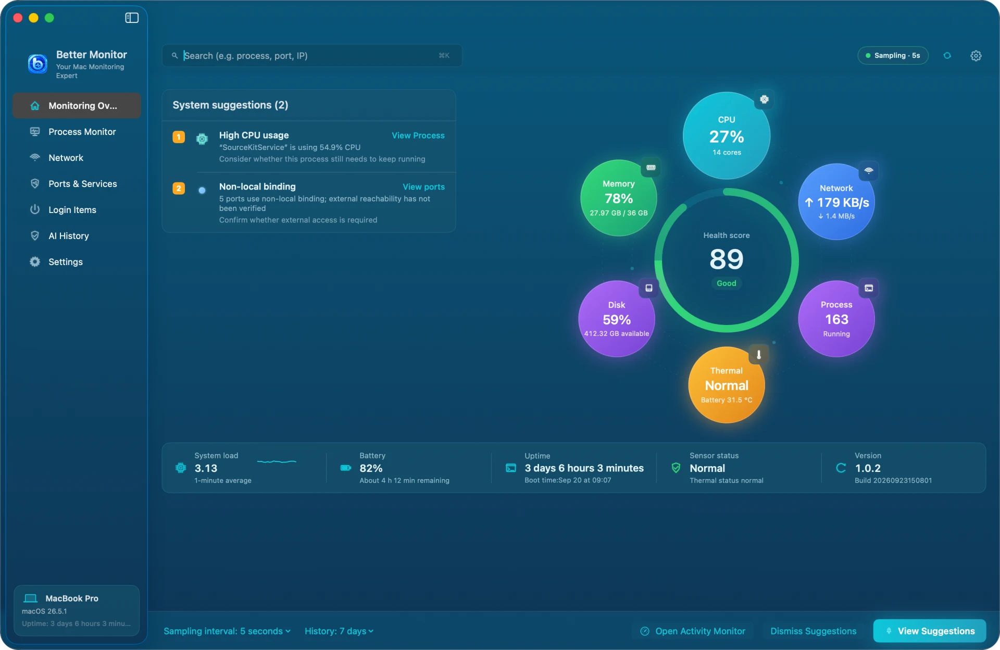
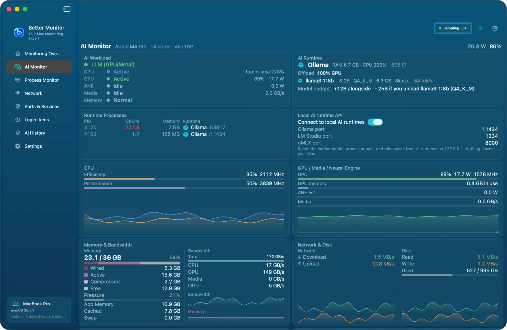
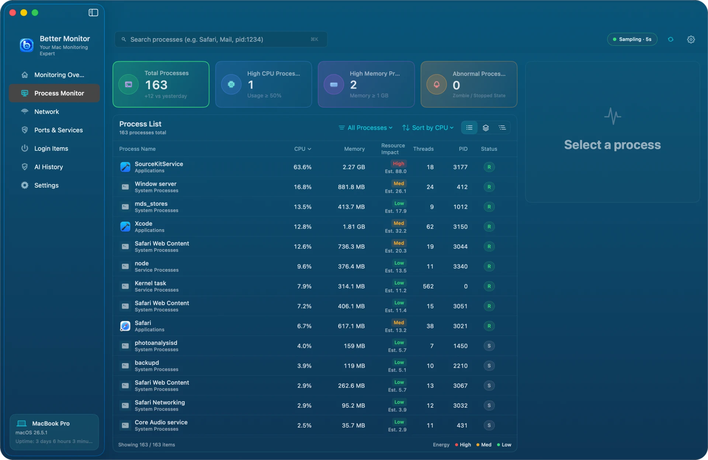
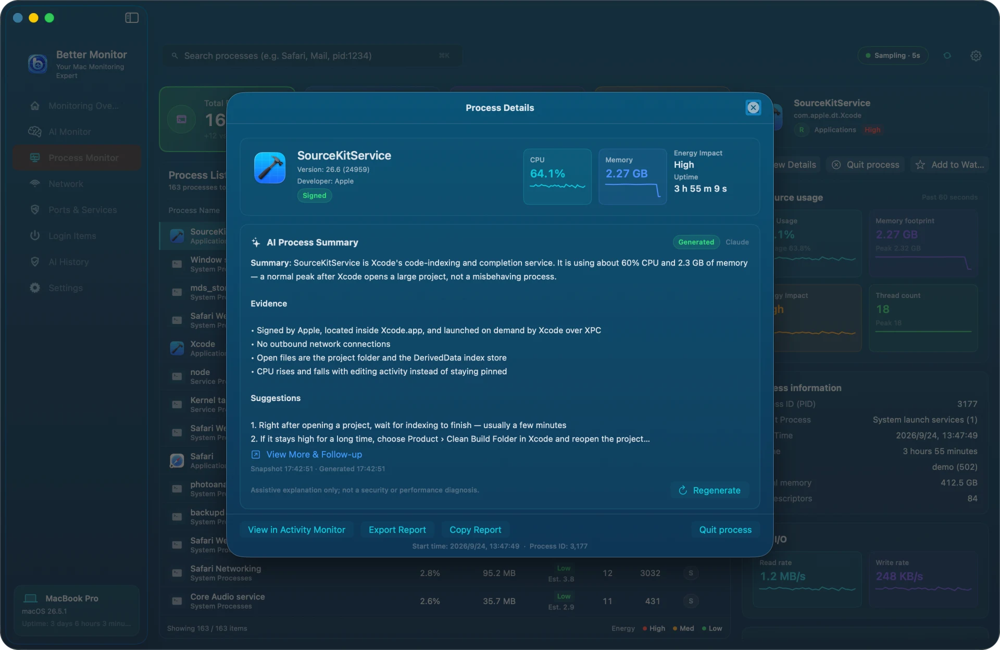
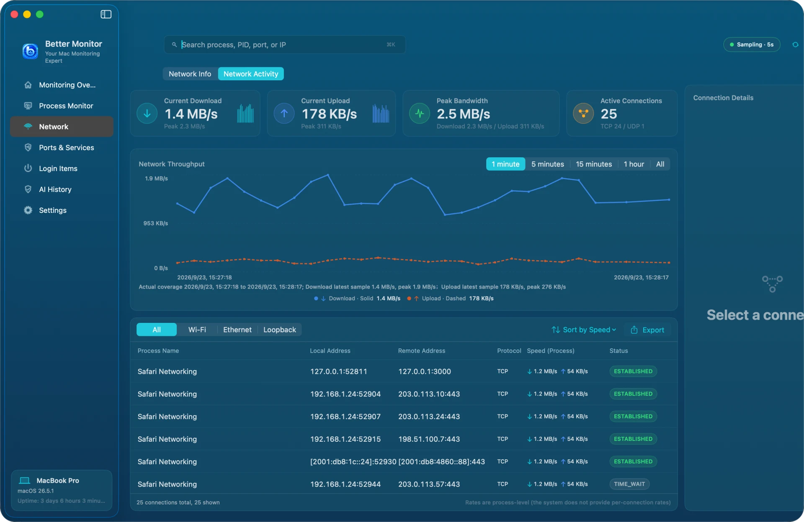
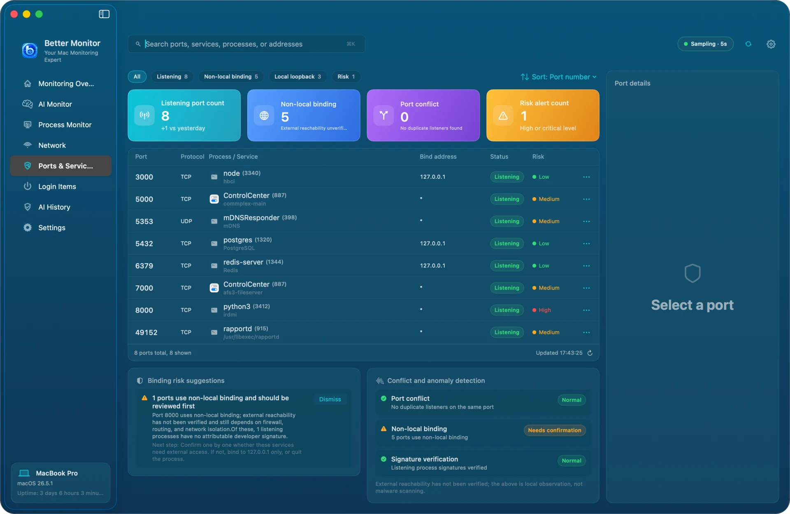
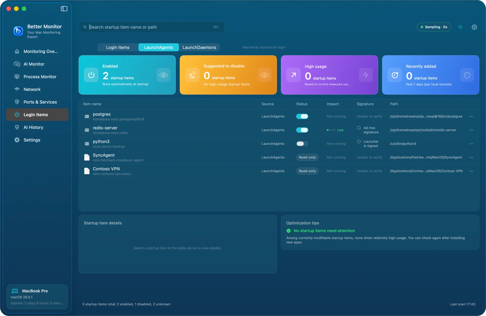
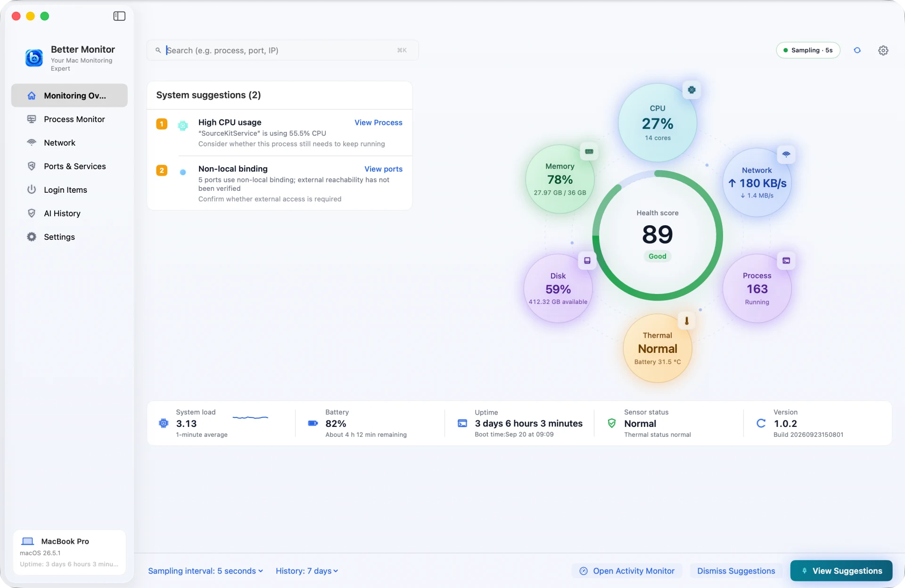

# Better Monitor

English · [简体中文](README.zh-CN.md) · [日本語](README.ja.md) · [한국어](README.ko.md)


A native macOS system monitor for understanding what your Mac is doing right now.

Better Monitor brings process, network, port, startup-item, and hardware information into one app for everyday observation and focused troubleshooting.



## When to use Better Monitor

- Check overall CPU, memory, disk, network, battery, sensor, and process status.
- Find an app or process using unusually high CPU or memory.
- Inspect active network connections, traffic, protocols, and destinations.
- Review listening ports, their owning processes, and risk signals.
- Review background startup items and their current resource impact.
- See whether a local model in Ollama, LM Studio, or MLX runs on the GPU or the Neural Engine, with memory bandwidth and tokens per second.

## Quick start

1. Install Better Monitor:

   ```bash
   brew install --cask bettermacnet/tap/better-monitor
   ```

2. Launch Better Monitor and choose a page from the navigation sidebar.
3. Open **Monitoring Overview** for a quick status check, **AI Monitor** to watch Apple silicon hardware and local AI runtimes, or use Process Monitor, Network, Ports & Services, and Login Items to investigate a specific issue.
4. Grant Location Services only if you want the current Wi-Fi name. macOS may still limit process and port details depending on permissions and system visibility.

You can also download the [latest release](https://github.com/BetterMacNet/better-monitor/releases/latest) and move `Better Monitor.app` to the Applications folder. Releases are signed with a Developer ID certificate and notarized by Apple; the notarization ticket is stapled to the disk image.

## Highlights

- **Monitoring overview** — See system health and key resource information at a glance.
- **AI Monitor** — Watch Apple silicon in detail — CPU clusters, GPU, Neural Engine, Media Engine, memory bandwidth, power, and sensors — plus local AI runtimes such as Ollama, LM Studio, and MLX with their loaded model and tokens per second.
- **Process monitor** — Inspect resource usage, identity, paths, network activity, and open files, with actions for processes you control.
- **Network activity** — Review interfaces, connections, traffic, protocols, TCP states, and destinations.
- **Ports and services** — Find listening ports, identify their owning processes, and surface useful risk signals.
- **Login Items** — Review readable LaunchAgents and LaunchDaemons, current resource impact, and modern login items through System Settings.
- **Optional AI assistance** — Configure your own provider and request an AI-assisted process diagnostic when you need it.
- **Native macOS experience** — Built with SwiftUI for macOS 15 or later.

The [user guide](docs/usage.en.md) walks through every page with screenshots; [features](docs/features.en.md) has a short summary.

## Screenshots



**AI Monitor** — see which engine a local model runs on and what limits it, from CPU clusters to memory bandwidth

| | |
|---|---|
|  |  |
| **Process Monitor** — sort by CPU, memory, or resource impact; list, aggregated, or tree view | **Process Details** — identity, signature, open files, and an optional AI summary |
|  |  |
| **Network Activity** — live throughput and every connection with its process and TCP state | **Ports & Services** — who is listening, on which address, and which bindings deserve a look |
|  |  |
| **Login Items** — login items, LaunchAgents, and LaunchDaemons with current impact and signatures | **Light and dark** — follows the system or your choice, in four interface languages |

Screenshots are generated with demo data; device names, paths, and addresses are fictional.

## Permissions and known limits

- Location Services is needed to show the current Wi-Fi network name. Better Monitor does not use this permission for location services.
- macOS may limit process and port details when the system does not expose them to the app.
- Modern login items managed by macOS are reviewed through System Settings rather than fully managed in the app.
- A non-local port bind is a signal to investigate, not proof of external reachability or a completed security audit.
- Startup-item impact reflects current runtime observations; it is not a measurement of boot time or a guaranteed saving after disabling an item.

## Privacy and optional AI

Core monitoring is local by default and does not require an account or cloud service. AI assistance is optional:

- Network access for an AI diagnostic occurs only after you configure a provider and explicitly request a summary.
- API keys are stored in the macOS Keychain.
- A data-disclosure notice is shown before diagnostic information is sent.
- A request may include process, network, path, and file-activity summaries needed for diagnosis. Review the provider's data handling before enabling the feature.
- Local AI conversations and monitoring history can be cleared in the app; clearing them does not remove data already sent to the provider.
- The provider's own retention and model-training terms apply to data sent for diagnosis.

You can use the core monitoring features without configuring AI.

## Documentation and support

- [Features](docs/features.en.md)
- [User guide](docs/usage.en.md)
- [Release notes](docs/release-notes.en.md)
- [User rules](RULES.md)
- [Latest release](https://github.com/BetterMacNet/better-monitor/releases/latest)
- [Report a bug](https://github.com/BetterMacNet/better-monitor/issues/new?template=bug_report.md)
- [Request a feature](https://github.com/BetterMacNet/better-monitor/issues/new?template=feature_request.md)
- [Security reporting](SECURITY.md)
- [Support center](https://bettermac.net/en/support/?product=better-monitor)
- [Contact us](https://bettermac.net/en/contact/?product=better-monitor)
- [Website](https://bettermac.net/)
- [Privacy Policy](https://bettermac.net/en/privacy/)
- [Terms of Use](https://bettermac.net/en/terms/)

## Requirements

- macOS 15.0 (Sequoia) or later
- Universal binary — Apple silicon and Intel
- AI Monitor requires Apple silicon; on Intel Macs the other pages keep working.

## License

Better Monitor and the original materials in this repository are proprietary and not open source. All rights reserved. No license is granted to copy, modify, distribute, or use them without prior written permission from BetterMacNet.

AI Monitor includes code from [SiliconScope](https://github.com/kennss/SiliconScope), which in turn draws on [NeoAsitop](https://github.com/op06072/NeoAsitop) and [Stats](https://github.com/exelban/stats). All three are MIT licensed; their notices ship inside the app as `ThirdPartyNotices.txt`.
