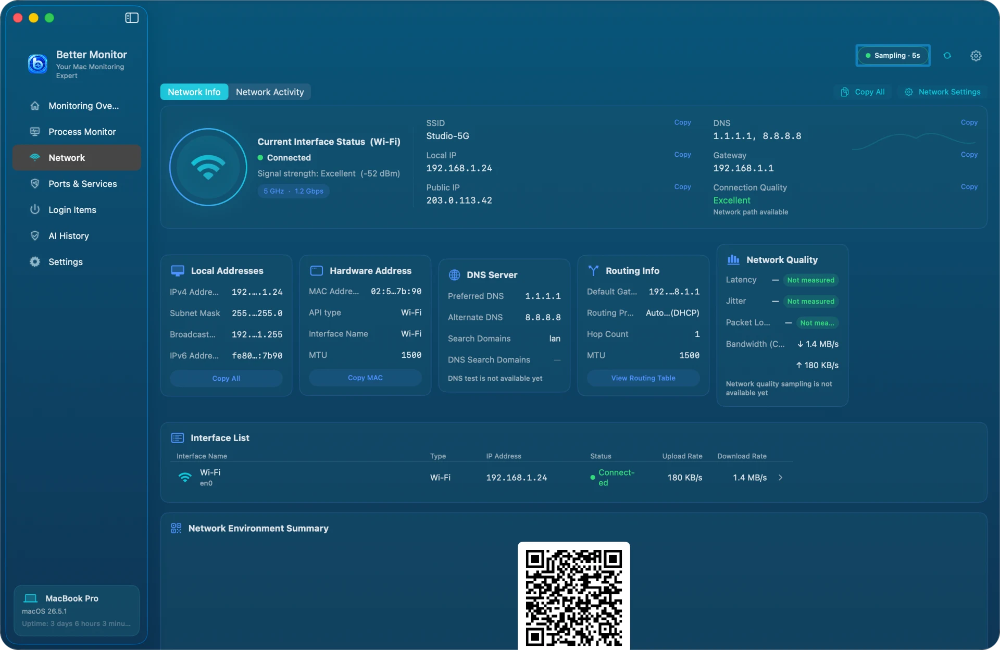
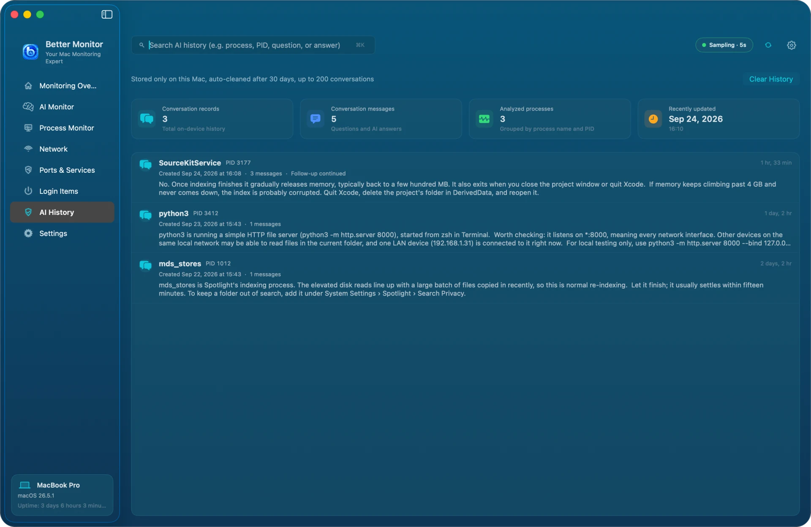
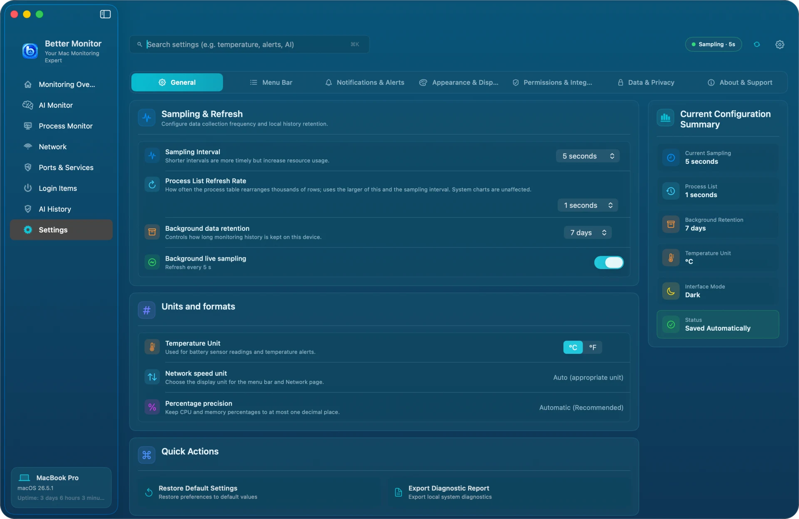
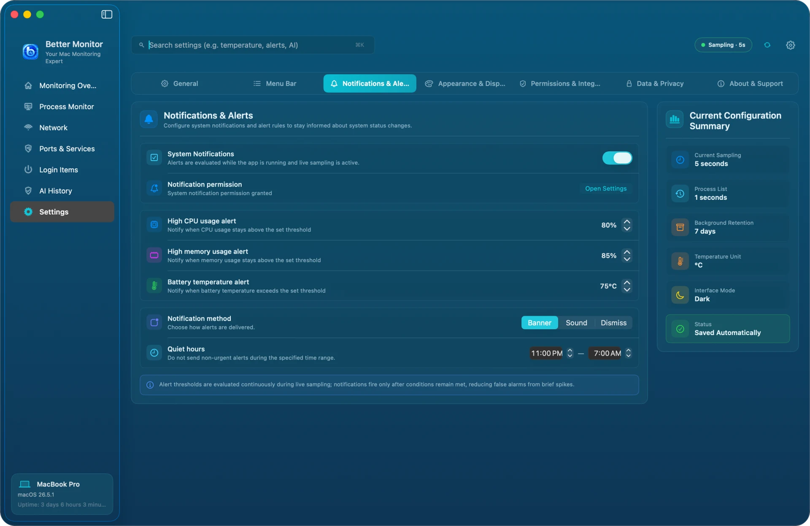
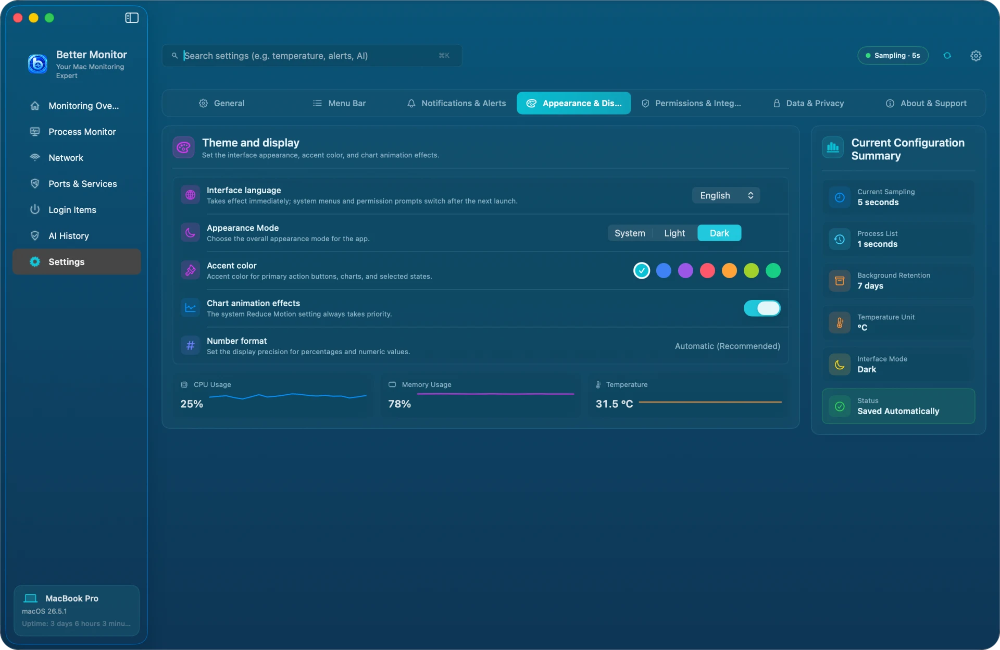
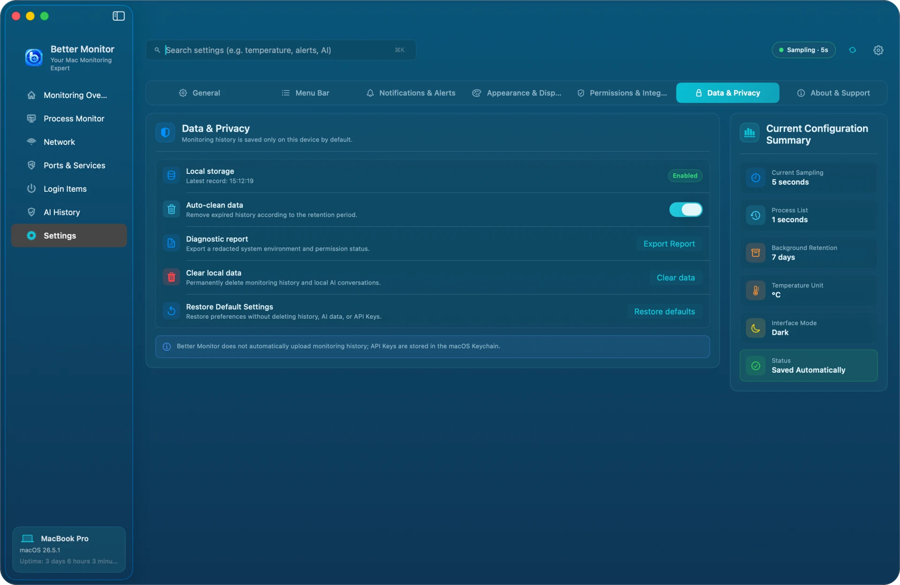

# Better Monitor User Guide

English · [简体中文](usage.md) · [日本語](usage.ja.md) · [한국어](usage.ko.md)

Better Monitor puts processes, network activity, ports, login items, and hardware status in one window, for a quick daily check or a focused investigation. This guide covers version 1.0.2 and walks through the interface page by page.

> The screenshots in this guide were generated with demo data. Device names, paths, IP addresses, and processes are fictional and do not belong to any real Mac.


## Contents

1. [Install and first launch](#install-and-first-launch)
2. [Permissions](#permissions)
3. [Layout and keyboard shortcuts](#layout-and-keyboard-shortcuts)
4. [Monitoring Overview](#monitoring-overview)
5. [Process Monitor](#process-monitor)
6. [Network](#network)
7. [Ports & Services](#ports--services)
8. [Login Items](#login-items)
9. [AI Process Summary and AI History](#ai-process-summary-and-ai-history)
10. [Menu bar](#menu-bar)
11. [Settings](#settings)
12. [Shortcuts](#shortcuts)
13. [Privacy and local data](#privacy-and-local-data)
14. [Troubleshooting](#troubleshooting)
15. [Uninstall](#uninstall)

## Install and first launch

**Requirements**: macOS 15 (Sequoia) or later. Universal binary for Apple silicon and Intel Macs.

Install with Homebrew:

```bash
brew install --cask bettermacnet/tap/better-monitor
```

Or download `BetterMonitor-1.0.2.dmg` from [GitHub Releases](https://github.com/BetterMacNet/better-monitor/releases/latest) and drag `Better Monitor.app` into the Applications folder. Every release is signed with a Developer ID certificate and notarized by Apple, so the first launch does not need a network check.

On first launch, Better Monitor shows **Terms & Privacy**: local-first monitoring, network lookups only when you trigger them, and the fact that macOS may refuse some actions. Choose **Agree and Continue** to open the main window, or **Decline and Quit** to exit without recording anything.

Once the main window opens, Better Monitor starts sampling every 5 seconds and adds an icon to the menu bar.

## Permissions

Better Monitor never asks for an administrator password and installs no system extensions. The permissions below are all optional; everything else works without them.

| Permission | Used for | Without it |
|---|---|---|
| Location Services | Reading the current Wi-Fi name (SSID). macOS requires this authorization to read the Wi-Fi name; Better Monitor never reads or records your location | The Wi-Fi name shows as unavailable; all other network details still work |
| Automation (System Events) | Reading the list of apps that open at login | The Login Items segment reports that it cannot read the list; LaunchAgents and LaunchDaemons are unaffected |
| Notifications | CPU, memory, and battery-temperature alerts | Alerts do not appear; monitoring continues |
| Accessibility | Reserved for extended features such as window details; core monitoring does not use it | No effect |

You can check each permission and jump to the matching System Settings pane from **Settings › Permissions & Integrations**.

macOS also does not expose every process and connection detail to regular apps. For processes owned by other users or protected by the system, the path, open files, or network owner may be unavailable. That is a system limit, not a malfunction.

## Layout and keyboard shortcuts

- **Sidebar**: seven pages — Monitoring Overview, Process Monitor, Network, Ports & Services, Login Items, AI History, and Settings. The card at the bottom shows the Mac model, macOS version, and uptime.
- **Top bar**: a search field for the current page on the left; the sampling status (for example "Sampling · 5s"), Refresh Now, and Settings on the right.
- **Bottom bar** (Overview page): change the sampling interval and history retention directly.

| Shortcut | Action |
|---|---|
| ⌘K | Focus the search field on the current page |
| ⌘R | Refresh now |
| ⌘. | Pause Monitoring / Continue Monitoring |
| ⌘, | Open Settings |

## Monitoring Overview

The Overview answers one question: how is this Mac doing right now?

- **Health score**: the ring in the middle scores CPU, memory usage, memory pressure, disk usage, and thermal state out of 100. 80 and above is **Good**, 60–79 is **Fair**, and lower is **Needs attention**.
- **Six metric bubbles**: CPU (with core count), memory (used / total), network (upload / download speed), disk (usage and free space), processes (how many are running), and thermal (system thermal state and battery temperature).
- **Suggestions**: listed on the left when something deserves a look — a process with high CPU usage, high memory pressure, low disk space, elevated thermal pressure, ports using a non-local binding, high network traffic, or many connections. Each suggestion has a button that takes you to the right page, such as **View Process** or **View ports**.
- **Status strip**: system load, battery level and time remaining, uptime and boot time, sensor status, and app version.
- **Bottom bar**: **View Suggestions** opens the suggestion list so you can work through it item by item; **Dismiss Suggestions** silences the current suggestions for 24 hours; **Open Activity Monitor** opens the Activity Monitor that ships with macOS.

The Overview in the light appearance:


## Process Monitor


**Four cards at the top**: Total Processes (with the change since yesterday), High CPU Processes (≥ 50%), High Memory Processes (≥ 1 GB), and Abnormal Processes (zombie or stopped). Click a card to show only those processes; click it again to clear the filter.

**Process list**:

- Three views: **All Processes** lists every process; **Aggregated View** groups the processes of one app (for example Safari's web content processes); **Process Tree** follows parent–child relationships.
- The **All Processes** menu filters by category (Applications, System Processes, Service Processes, and so on). The sort menu covers CPU, memory, resource impact, threads, PID, and more.
- **Resource Impact** is a local estimate from current CPU and resident memory, rated high, medium, or low. It is meant for quick sorting, not as an energy measurement.
- In the status column, R means running and S means sleeping.

**Select a process** to see its usage charts, path, and basic details on the right, with **View Details**, **Quit process**, and **Add to Watch**. Watched processes are matched by executable path, so they stay tracked after a restart gives them a new PID.

**Process Details**:


The details window shows:

- identity: name, version, developer, and code-signing status;
- the AI Process Summary (see below; requires an AI service);
- the executable path;
- CPU, memory, threads, and disk read/write, with recent charts;
- parent process, user, start time, and uptime;
- open files, taken from the system's file-descriptor table (memory-mapped libraries are not included).

At the bottom you can **View in Activity Monitor**, **Export Report**, **Copy Report**, or **Quit process**. Quitting asks for confirmation and reminds you that unsaved data in the process may be lost. System processes and processes owned by other users usually cannot be quit; that is a macOS permission limit.

## Network

The Network page has two tabs: **Network Info** and **Network Activity**.

### Network Info



- Current interface status: interface type, connection state, signal strength, band, and link rate.
- SSID (requires Location Services), local IP, public IP, DNS, gateway, and connection quality.
- Five cards — Local Addresses, Hardware Address, DNS Server, Routing Info, and Network Quality — plus the Interface List of every active interface.
- **Copy All** copies all of this as text; **Network Settings** opens the system's network settings.

**The public IP shows "Not queried" until you click it**, and only then does Better Monitor contact the network to look it up. Apart from AI summaries, this is the only outbound request the app makes.

### Network Activity


- At the top: current download, current upload, peak bandwidth, and active connections (TCP / UDP).
- The Network Throughput chart switches between 1 minute, 5 minutes, 15 minutes, 1 hour, and All. The 1-hour and All ranges come from local history and keep only the combined upload + download rate.
- The connection list filters by All, Wi-Fi, Ethernet, and Loopback and shows the process, local address, remote address, protocol, speed, and TCP state. You can sort by speed and export the list.
- Select a connection to see everything about it in **Connection Details**.

Note: macOS does not report per-connection speeds, so the speed column shows the overall rate of the process that owns the connection.

## Ports & Services


This page answers: which ports is this Mac listening on, who owns them, and are any of them exposed?

- Filters at the top: All, Listening, Non-local binding, Local loopback, and Risk.
- Four cards: Listening port count (with the change since yesterday), Non-local binding, Port conflict, and Risk alert count.
- The list shows port, protocol, process and service name, binding address, state, and risk level. The **⋯** button at the end of a row lets you **Copy port info**, **Reveal executable in Finder**, or **Quit process**.
- **Binding risk suggestions** explain why a port is flagged and what to do next, such as binding it to 127.0.0.1 only.
- **Conflict and anomaly detection** checks for duplicate listeners, non-local bindings, and the signatures of listening processes.

What the binding address means: `127.0.0.1` or `::1` is reachable only from this Mac; `*`, `0.0.0.0`, or `::` listens on every network interface. **A non-local binding is a signal to check, not proof that the port is reachable from outside.** Firewalls, routers, and network isolation all affect reachability. Better Monitor does not scan ports and is not a security audit tool. Services built into macOS, such as the AirPlay Receiver on ports 5000 and 7000, listen on all interfaces by design and usually need no action.

## Login Items


This page collects everything that runs automatically after you log in, in three segments:

- **Login Items**: apps listed under "Open at Login" in System Settings › General › Login Items & Extensions. macOS manages these, so they are read-only here; use **Open System Login Items** to change them in System Settings.
- **LaunchAgents**: started by launchd when you log in. Items in your own `~/Library/LaunchAgents` folder can be enabled or disabled right here; system-wide items in `/Library/LaunchAgents` are read-only.
- **LaunchDaemons**: started with system privileges at boot. Read-only.

Four cards: Enabled, Suggested to disable, High usage, and Recently added (counted from when this Mac first saw the item). **Impact** is the *current* resource usage of the item's process — it is not boot time, and disabling an item does not guarantee a saving. When one program runs as several processes (PostgreSQL, for example), Better Monitor cannot tell which one belongs to the item and shows **Not running**. The signature column shows states such as Signature valid, Ad-hoc signature, and Unable to verify. Items started through a script interpreter (python, node, bash, and so on) are marked **Launcher is signed**, a reminder that what actually runs is a script.

## AI Process Summary and AI History

AI features are optional. Every monitoring feature works without them.

**Set up**: open **Settings › Permissions & Integrations › AI Service › Manage** and add an AI API Configuration:

- API type: Anthropic, or any service compatible with OpenAI Chat Completions;
- name, endpoint (must be HTTPS), and model;
- the API key is stored in the macOS Keychain. When editing, leave it blank to keep the existing key.

You can save several configurations and choose one with **Set as current**.

**Generate a summary**: open any process's details and generate from the **AI Process Summary** card. The first time, Better Monitor asks **Send process details to the AI service?** and explains what will be sent: the process's full path, PID, resource and network observations, and the paths of its open files. **File contents, other processes, and your API key are never sent.** Nothing is sent until you choose **Agree and Generate**.

After the summary appears, **View More & Follow-up** lets you keep asking about that process, and **Regenerate** produces a new summary. AI output is an aid to understanding, not a security or performance diagnosis; the final judgment is yours.

**AI History**:



Every summary and follow-up is saved on this Mac, grouped by process, for 30 days and up to 200 conversations. Search by process name, PID, question, or answer, or use **Clear History**. Clearing removes only the local records; data already sent to an AI provider is governed by that provider's retention and training policies.

## Menu bar

While Better Monitor runs, its icon sits in the menu bar. Click it for a live panel with current CPU, memory, storage, battery, and network values and recent charts, plus **Open Better Monitor** and **Refresh Now**.

By default the menu bar shows only the icon. Turn on **Menu bar live data** in **Settings › Menu Bar** to show CPU, memory, network speed, temperature, or disk activity directly in the menu bar, and choose between the Compact style (only the first available metric) and the Detailed style. A preview shows the result.

## Settings

Settings has seven sections.

**General**: Sampling Interval (1, 2, 5, or 10 seconds), Process List Refresh Rate, Background data retention (1, 3, or 7 days), and Background live sampling; temperature unit, network speed unit, and percentage precision; Restore Default Settings and Export Diagnostic Report.



**Menu Bar**: see the previous section.

**Notifications & Alerts**: the System Notifications switch; thresholds for the High CPU usage alert, High memory usage alert, and Battery temperature alert; notification method (Banner, Sound, or Dismiss); and quiet hours. An alert fires only when its condition holds continuously, so a brief spike does not trigger it.



**Appearance & Display**: interface language (简体中文, English, 日本語, 한국어, or follow the system; changes apply immediately), appearance mode (System, Light, Dark), accent color, chart animation effects, and number format.



**Permissions & Integrations**: status and shortcuts for each system permission, Open at login, the Shortcuts support switch, AI Service management, and Export Diagnostic Report.

**Data & Privacy**: local storage status; auto-clean expired data; export a de-identified diagnostic report; Clear local data (permanently deletes monitoring history and local AI conversations); and Restore Default Settings (restores preferences only — history, AI data, and API keys are kept).



**About & Support**: app version, plus links to help, the privacy policy, the terms of use, and the Support Center.

## Shortcuts

Better Monitor provides three actions for the Shortcuts app:

- Open Better Monitor
- Pause Better Monitor sampling
- Resume Better Monitor sampling

For example, a Focus automation can pause sampling before a presentation. To stop Shortcuts from controlling sampling, turn off **Shortcuts support** in **Settings › Permissions & Integrations**.

## Privacy and local data

- Monitoring data is read and stored on this Mac only. No account is needed and nothing is uploaded automatically.
- Better Monitor goes online in only two cases: when you look up the public IP, and when you request an AI summary or follow-up (sent to the provider you configured).
- Where data lives:
  - monitoring history and AI conversations: `~/Library/Application Support/net.better.mac.monitor/`
  - preferences: `~/Library/Preferences/net.better.mac.monitor.plist`
  - AI API keys: the `net.better.mac.monitor.ai` item in your Keychain
- Clear local data from **Settings › Data & Privacy**. Deleting an AI configuration also deletes its API key.

See the full [Privacy Policy](https://bettermac.net/en/privacy/).

## Troubleshooting

**The Wi-Fi name shows as unavailable**
Open System Settings › Privacy & Security › Location Services, allow Better Monitor, then refresh the Network page.

**The Login Items segment cannot read anything**
This segment reads the list through System Events. Open System Settings › Privacy & Security › Automation, allow Better Monitor to control System Events, then refresh the Login Items page.

**Quitting a process fails**
Regular apps cannot quit system processes, processes owned by other users, or processes protected by System Integrity Protection. Better Monitor also re-checks the process identity right before sending the signal: if the PID has been reused by a different process, the action is refused so the wrong process is never hit.

**A port shows no owning process, or a value shows "—"**
macOS may not expose details for processes owned by other users or by root. "—" means the value cannot be read right now, not that it is zero.

**Charts are empty, or the status stays at "Waiting for sample"**
Check whether monitoring is paused in the top bar (⌘. resumes it) and whether **Settings › General › Background live sampling** is on.

**How much does Better Monitor itself use?**
The process list and network inventory refresh only while the window is visible and needs them; with the window hidden, only lightweight system metrics are sampled. Raise the sampling interval in **Settings › General** to lower the overhead further.

Still stuck? Visit the [Support Center](https://bettermac.net/en/support/?product=better-monitor) or [open an issue](https://github.com/BetterMacNet/better-monitor/issues/new?template=bug_report.md).

## Uninstall

If you installed with Homebrew:

```bash
brew uninstall --cask better-monitor
# also remove local data
brew uninstall --zap --cask better-monitor
```

If you installed manually: quit Better Monitor and move `Better Monitor.app` from Applications to the Trash. To remove data as well, delete the folder and preference file listed under [Privacy and local data](#privacy-and-local-data). `--zap` does not remove the API key from the Keychain; delete your AI configuration in the app first, or remove `net.better.mac.monitor.ai` in Keychain Access.
