# Better Monitor ユーザーガイド

[English](usage.en.md) · [简体中文](usage.md) · 日本語 · [한국어](usage.ko.md)

Better Monitor は、プロセス、ネットワーク、ポート、ログイン項目、ハードウェアの状態を 1 つのウインドウにまとめた macOS 用のシステムモニタです。日々の確認にも、問題の切り分けにも使えます。このガイドはバージョン 1.0.3 を対象に、画面ごとに順を追って説明します。

> このガイドのスクリーンショットはデモデータで作成しています。デバイス名、パス、IP アドレス、プロセスはすべて架空のもので、実在の Mac とは関係ありません。

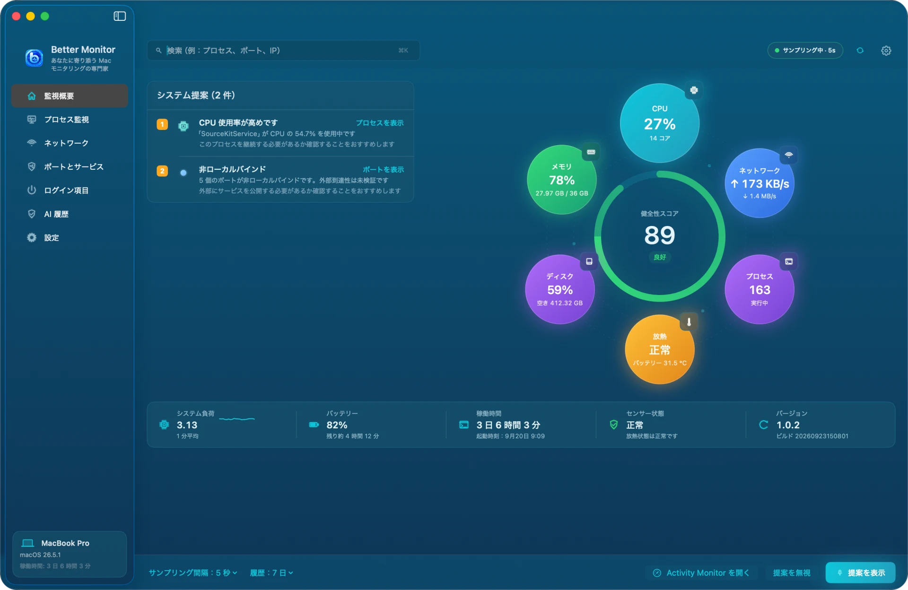

## 目次

1. [インストールと初回起動](#インストールと初回起動)
2. [権限について](#権限について)
3. [画面構成とキーボードショートカット](#画面構成とキーボードショートカット)
4. [監視概要](#監視概要)
5. [AI モニター](#ai-モニター)
6. [プロセス監視](#プロセス監視)
7. [ネットワーク](#ネットワーク)
8. [ポートとサービス](#ポートとサービス)
9. [ログイン項目](#ログイン項目)
10. [AI プロセス要約と AI 履歴](#ai-プロセス要約と-ai-履歴)
11. [メニューバー](#メニューバー)
12. [設定](#設定)
13. [ショートカット](#ショートカット)
14. [プライバシーとローカルデータ](#プライバシーとローカルデータ)
15. [よくある質問](#よくある質問)
16. [アンインストール](#アンインストール)

## インストールと初回起動

**動作環境**：macOS 15（Sequoia）以降。Apple シリコンと Intel Mac の両方に対応したユニバーサルバイナリです。

Homebrew でインストール：

```bash
brew install --cask bettermacnet/tap/better-monitor
```

または [GitHub Releases](https://github.com/BetterMacNet/better-monitor/releases/latest) から `BetterMonitor-1.0.3.dmg` をダウンロードし、`Better Monitor.app` を「アプリケーション」フォルダにドラッグします。各リリースは Developer ID で署名され、Apple の公証を受けているため、初回起動時にネットワークでの確認は不要です。

初回起動時には「利用規約とプライバシー」が表示され、ローカル優先であること、ネットワークへの問い合わせは手動で実行したときだけであること、操作が macOS に拒否される場合があることなどが示されます。「同意して続行」を選ぶとメインウインドウが開き、「拒否して終了」を選ぶと何も記録せずに終了します。

メインウインドウが開くと、Better Monitor は 5 秒間隔でサンプリングを始め、メニューバーにアイコンを追加します。

## 権限について

Better Monitor が管理者パスワードを求めることはなく、システム拡張もインストールしません。次の権限はすべて任意で、許可しなくても他の機能は使えます。

| 権限 | 用途 | 許可しない場合 |
|---|---|---|
| 位置情報サービス | 現在の Wi-Fi 名（SSID）の取得。macOS では Wi-Fi 名の取得にこの許可が必要です。Better Monitor が位置情報を読み取ったり記録したりすることはありません | Wi-Fi 名が取得できない旨の表示になります。その他のネットワーク情報は通常どおり表示されます |
| オートメーション（System Events） | 「ログイン時に開く」アプリの一覧の取得 | ログイン項目セグメントで一覧を読み取れない旨が表示されます。LaunchAgents と LaunchDaemons には影響しません |
| 通知 | CPU、メモリ、バッテリー温度のアラート | アラートは表示されませんが、監視は続きます |
| アクセシビリティ | ウインドウ情報などの拡張機能用。基本の監視には使いません | 影響なし |

各権限の状態は「設定 › 権限と統合」で確認でき、そこから対応するシステム設定の画面に移動できます。

また、macOS はすべてのプロセスや接続の詳細を一般のアプリに公開しているわけではありません。他のユーザーのプロセスやシステムに保護されたプロセスでは、パス、開いているファイル、ネットワークの所属が取得できないことがあります。これはシステムの制限で、不具合ではありません。

## 画面構成とキーボードショートカット

- **サイドバー**：監視概要、AI モニター、プロセス監視、ネットワーク、ポートとサービス、ログイン項目、AI 履歴、設定の 8 画面。下部のカードに Mac の機種、macOS のバージョン、稼働時間が表示されます。
- **上部バー**：左側は現在の画面の検索フィールド。右側にはサンプリング状態（例：「サンプリング中 · 5s」）、今すぐ更新、設定のボタンがあります。
- **下部バー**（監視概要）：サンプリング間隔と履歴の保持日数をその場で変更できます。

| ショートカット | 動作 |
|---|---|
| ⌘K | 現在の画面の検索フィールドに移動 |
| ⌘R | 今すぐ更新 |
| ⌘. | 監視を一時停止 / モニタリングを続ける |
| ⌘, | 設定を開く |

## 監視概要

監視概要は「この Mac はいまどういう状態か」をすばやく確認するための画面です。

- **健全性スコア**：中央のリングが、CPU、メモリ使用率、メモリ圧力、ディスク使用率、放熱状態から 100 点満点で採点します。80 点以上は「良好」、60〜79 点は「普通」、それ未満は「要注意」です。
- **6 つの指標**：CPU（コア数）、メモリ（使用量 / 総容量）、ネットワーク（アップロード / ダウンロード速度）、ディスク（使用率と空き容量）、プロセス（実行中の数）、放熱（システムの放熱状態とバッテリー温度）。
- **提案**：注意が必要な状態を左側に一覧表示します。例：CPU 使用率が高いプロセス、高いメモリ圧力、ディスク容量の不足、放熱の圧力、非ローカルバインドのポート、多いネットワークトラフィックや接続数。各提案には「プロセスを表示」「ポートを表示」など、該当する画面へ移動するボタンがあります。
- **ステータスバー**：システム負荷、バッテリー残量と残り時間、稼働時間と起動時刻、センサー状態、アプリのバージョン。
- **下部バー**：「提案を表示」で提案の一覧を開き、1 件ずつ確認できます。「提案を無視」は現在の提案を 24 時間非表示にします。「Activity Monitor を開く」は macOS 標準のアクティビティモニタを開きます。

ライトモードの監視概要：

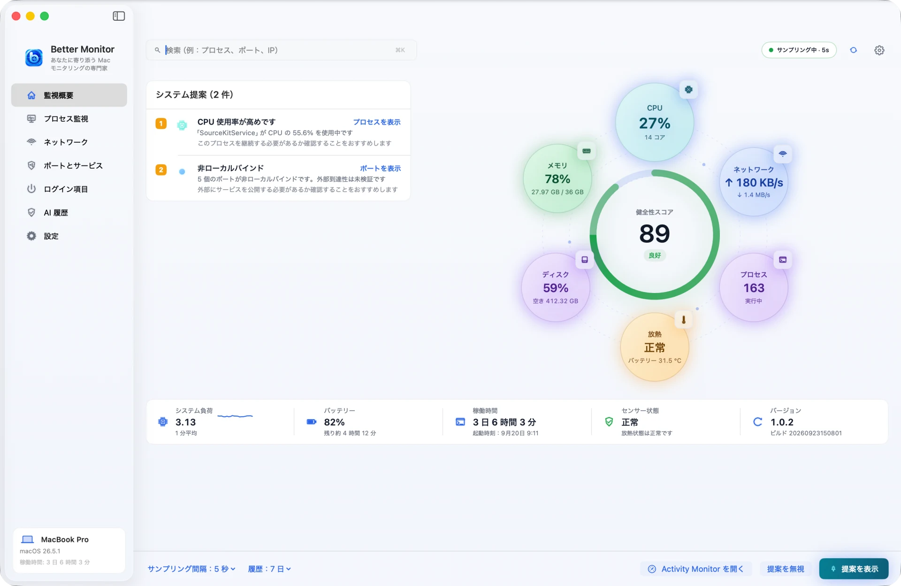

## AI モニター

AI モニターでは、Apple シリコンがいま何をしているか、ローカル AI モデルがどこで動いているかを詳しく確認できます。サイドバーの「監視概要」の下にあり、Apple シリコン搭載の Mac が必要です。

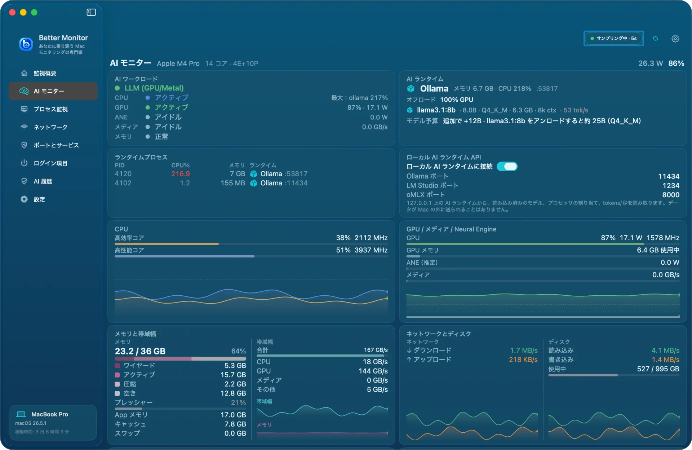

- **AI ワークロード**：現在の処理が何かをひと言で判定します（GPU（Metal）上の LLM、Neural Engine 上の Core ML、メディアエンジン上の動画、アイドル）。CPU、GPU、Neural Engine、メディアエンジン、メモリそれぞれの状態と値もあわせて表示します。
- **AI ランタイム**：Ollama、LM Studio、MLX、llama.cpp などのローカルランタイムをプロセスから検出し、メモリと CPU の使用量、モデル予算（メモリに収まる最大のモデル）を表示します。
- **ランタイムプロセス** と **ローカル AI ランタイム API**：検出したランタイムのプロセスを一覧表示します。「ローカル AI ランタイムに接続」をオンにすると、127.0.0.1 上のランタイム API から読み込み済みのモデル、GPU/CPU の割り当て、tokens/秒を読み取ります。データが Mac の外に送られることはありません。Better Monitor がランタイムを起動したり、ポートをスキャンしたりすることはありません。
- **CPU** と **GPU / メディア / Neural Engine**：高効率コアと高性能コアの使用率とクロック、GPU の使用率・電力・メモリ、Neural Engine の電力、メディアエンジンの帯域幅を、それぞれ 1 分間の推移とともに表示します。チップが熱でスロットリングしているあいだは、該当するカードの枠が赤くなります。
- **メモリと帯域幅**、**ネットワークとディスク**：メモリの内訳とプレッシャー、ユニファイドメモリの帯域幅、ネットワークとディスクの速度。
- **センサー** と **プロセスリスト**：ファンの回転数とグループ別の温度センサー。プロセスリストは絞り込みと並べ替えができ、プロセスをクリックするとプロセスごとの詳細（CPU、IPC、エネルギー、メモリ、Neural Engine メモリ）を開きます。終了と強制終了にはプロセス監視と同じ安全確認が適用されます。

AI モニターはページを表示しているあいだだけサンプリングし、監視を一時停止すると止まります。チップによってはメモリ帯域幅の合計しか取得できず、その場合 CPU / GPU / メディアの内訳は 0 と表示されます。

## プロセス監視

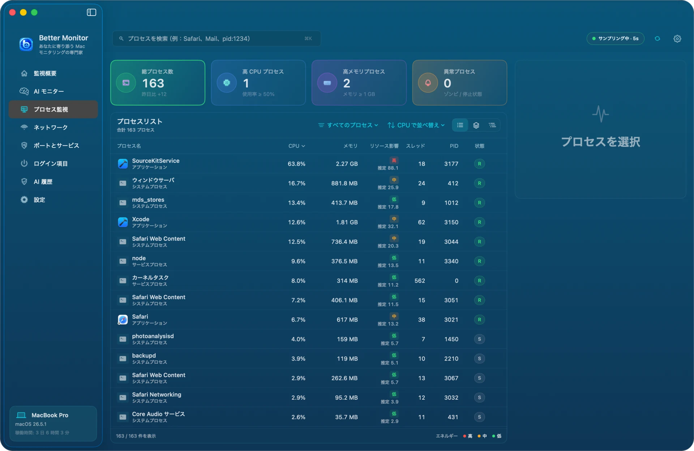

**上部の 4 つのカード**：総プロセス数（前日比つき）、高 CPU プロセス（50% 以上）、高メモリプロセス（1 GB 以上）、異常プロセス（ゾンビまたは停止状態）。カードをクリックすると該当するプロセスだけを表示し、もう一度クリックすると解除します。

**プロセスリスト**：

- 3 種類の表示：**すべてのプロセス**は 1 つずつ一覧表示します。**集約ビュー**は同じアプリの複数のプロセス（Safari の Web コンテンツプロセスなど）を 1 つのグループにまとめます。**プロセスツリー**は親子関係に沿って展開します。
- 「すべてのプロセス」メニューでカテゴリ（アプリケーション、システムプロセス、サービスプロセスなど）で絞り込み、並べ替えメニューで CPU、メモリ、リソース影響、スレッド数、PID などの順に並べ替えられます。
- 「リソース影響」は現在の CPU と常駐メモリから算出したローカルな推定値で、高・中・低の 3 段階です。すばやく並べ替えるための目安で、消費電力の正確な測定ではありません。
- 状態列の R は実行中、S はスリープ中を表します。

**プロセスを選択**すると、右側に使用状況のグラフ、パス、基本情報が表示され、「詳細を表示」「プロセスを終了」「監視に追加」を実行できます。監視に追加したプロセスは実行ファイルのパスで識別するため、再起動して PID が変わっても追跡を続けます。

**プロセス詳細**：

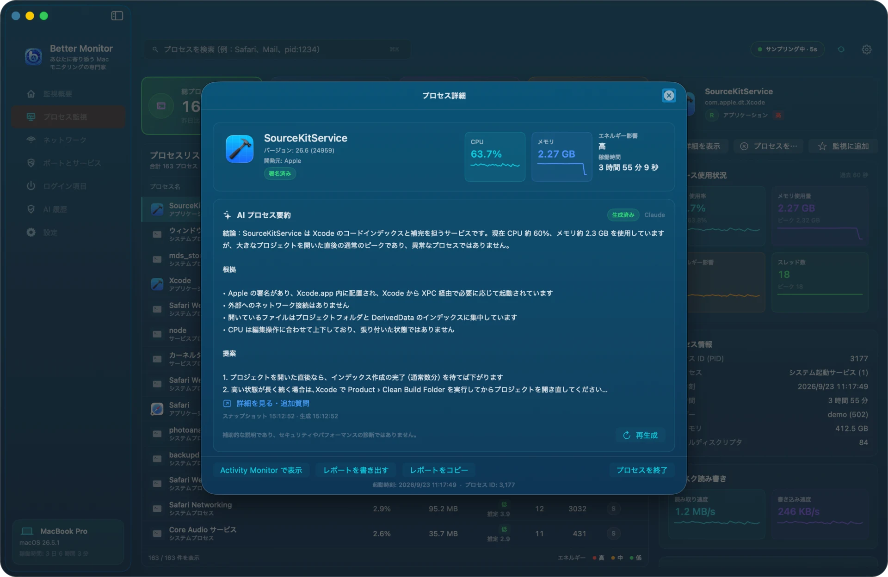

詳細ウインドウには次の内容が表示されます：

- 識別情報：名前、バージョン、開発元、コード署名の状態
- AI プロセス要約（後述。AI サービスの設定が必要）
- 実行ファイルのパス
- CPU、メモリ、スレッド、ディスクの読み書きと直近のグラフ
- 親プロセス、ユーザー、起動時刻、実行時間
- 開いているファイル（システムのファイルディスクリプタ表から取得。メモリにマップされたライブラリは含みません）

下部から「Activity Monitor で表示」「レポートを書き出す」「レポートをコピー」「プロセスを終了」を実行できます。終了の前には確認があり、プロセス内の未保存のデータが失われる可能性があることが示されます。システムプロセスや他のユーザーのプロセスは通常終了できません。これは macOS の権限による制限です。

## ネットワーク

ネットワーク画面には「ネットワーク情報」と「ネットワーク活動」の 2 つのタブがあります。

### ネットワーク情報

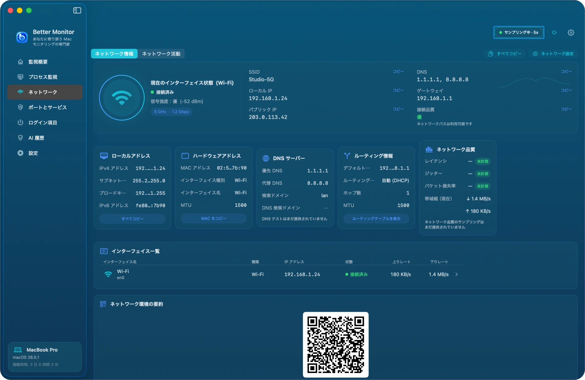

- 現在のインターフェイスの状態：種類、接続状態、信号強度、周波数帯とリンク速度
- SSID（位置情報サービスの許可が必要）、ローカル IP、パブリック IP、DNS、ゲートウェイ、接続品質
- ローカルアドレス、ハードウェアアドレス、DNS サーバー、ルーティング情報、ネットワーク品質の 5 つのカードと、すべてのアクティブなインターフェイスの一覧
- 右上の「すべてコピー」でこれらの情報をテキストとしてコピーし、「ネットワーク設定」でシステムのネットワーク設定を開きます。

**パブリック IP は初期状態では「未照会」と表示され、クリックしたときにだけネットワークに問い合わせます。** AI 要約を除けば、これが Better Monitor が行う唯一の外部への通信です。

### ネットワーク活動

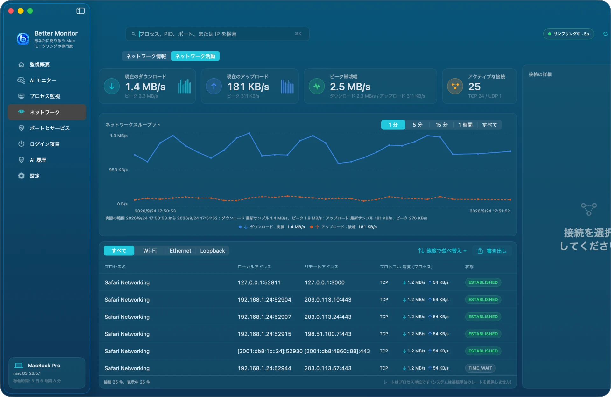

- 上部：現在のダウンロード、現在のアップロード、ピーク帯域幅、アクティブな接続数（TCP / UDP）
- ネットワークスループットのグラフは 1 分、5 分、15 分、1 時間、すべてを切り替えられます。1 時間とすべてはローカルの履歴を使い、アップロードとダウンロードの合計速度のみを保持します。
- 接続リストは「すべて」「Wi-Fi」「Ethernet」「Loopback」で絞り込め、プロセス、ローカルアドレス、リモートアドレス、プロトコル、速度、TCP 状態を表示します。速度順の並べ替えと書き出しにも対応しています。
- 接続を選択すると、右側の「接続の詳細」にすべての情報が表示されます。

注：macOS は接続ごとの速度を提供していないため、一覧の「速度」はその接続が属するプロセス全体の速度です。

## ポートとサービス

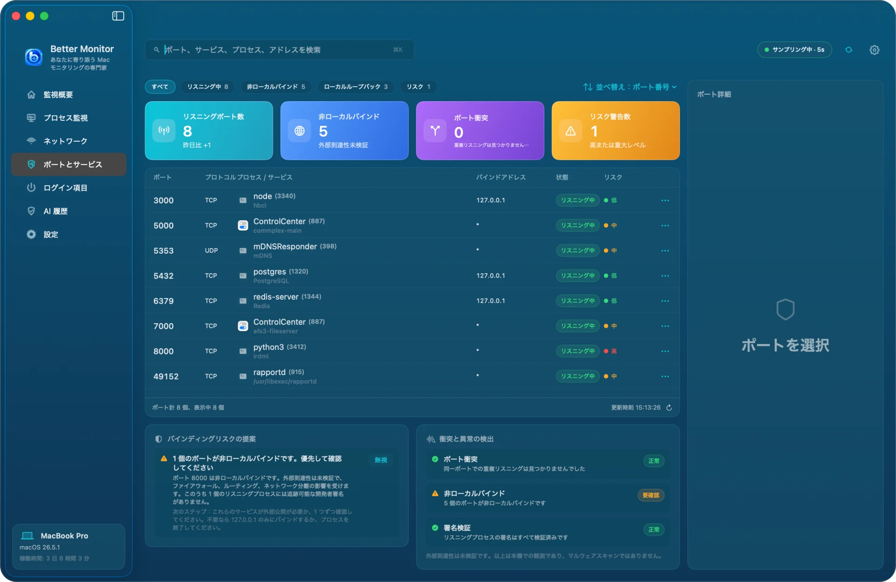

この画面では「この Mac がどのポートで待ち受けていて、それが誰のもので、外部に公開されていないか」を確認できます。

- 上部の絞り込み：すべて、リスニング中、非ローカルバインド、ローカルループバック、リスク
- 4 つのカード：リスニングポート数（前日比つき）、非ローカルバインド、ポート衝突、リスク警告数
- 一覧には、ポート、プロトコル、プロセスとサービス名、バインドアドレス、状態、リスクレベルが表示されます。行末の「⋯」から「ポート情報をコピー」「Finder で実行ファイルを表示」「プロセスを終了」を実行できます。
- 「バインディングリスクの提案」は、そのポートがリスクとされた理由と次の対応（127.0.0.1 のみで待ち受けるように変更するなど）を説明します。
- 「衝突と異常の検出」は、重複リスニング、非ローカルバインド、待ち受けプロセスの署名をチェックします。

バインドアドレスの意味：`127.0.0.1` または `::1` はこの Mac からしかアクセスできません。`*`、`0.0.0.0`、`::` はすべてのネットワークインターフェイスで待ち受けます。**非ローカルバインドは確認すべきサインであって、実際に外部からアクセスできることの証明ではありません。** 到達できるかどうかはファイアウォール、ルーター、ネットワークの分離によっても変わります。Better Monitor はポートスキャンを行わず、セキュリティ監査ツールでもありません。macOS 標準の AirPlay レシーバー（ポート 5000 と 7000）などは、もともとすべてのインターフェイスで待ち受ける仕様で、通常は対応不要です。

## ログイン項目

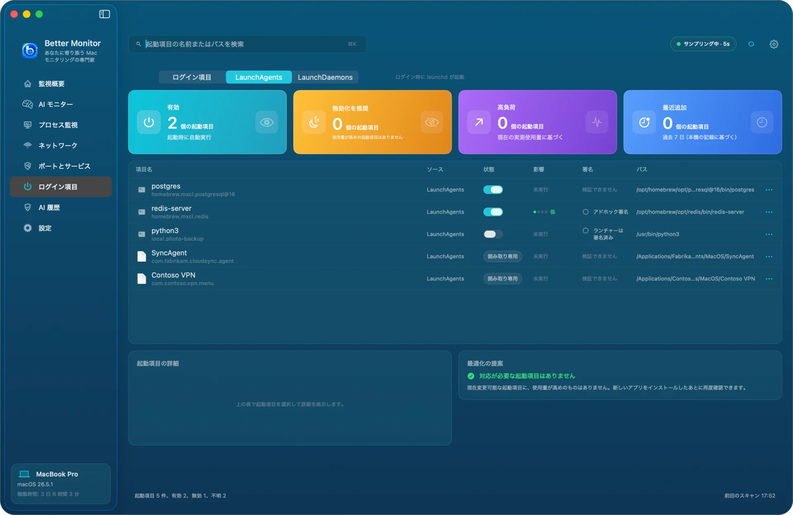

この画面は、ログイン後に自動で実行されるものを 3 つのセグメントにまとめて表示します。

- **ログイン項目**：「システム設定 › 一般 › ログイン項目と機能拡張」の「ログイン時に開く」に登録されたアプリ。macOS が管理しているためここでは読み取り専用です。「システムのログイン項目を開く」からシステム設定で変更します。
- **LaunchAgents**：ログイン時に launchd が起動します。自分の `~/Library/LaunchAgents` にある項目はここで直接有効・無効を切り替えられます。`/Library/LaunchAgents` にあるシステム全体の項目は読み取り専用です。
- **LaunchDaemons**：起動時にシステム権限で実行されます。読み取り専用です。

4 つのカード：有効、無効化を推奨、高負荷、最近追加（この Mac で初めて検出した日時に基づく）。一覧の「影響」はその項目のプロセスの**現在の**リソース使用量で、起動にかかる時間ではありません。無効にしても必ず節約になるとは限りません。1 つのプログラムが複数のプロセスで動いている場合（PostgreSQL など）は、どれが該当するか判別できないため「未実行」と表示されます。署名列には「署名は有効」「アドホック署名」「検証できません」などの状態が表示されます。スクリプトインタプリタ（python、node、bash など）経由で起動する項目は「ランチャーは署名済み」と表示され、実際に動いているのはスクリプトであることを示します。

## AI プロセス要約と AI 履歴

AI 機能は任意です。設定しなくても監視機能はすべて使えます。

**設定**：「設定 › 権限と統合 › AI サービス › 管理」を開き、AI API 構成を追加します。

- インターフェイス種別：Anthropic、または OpenAI Chat Completions 互換のサービス
- 名前、Endpoint（HTTPS が必須）、モデル
- API キーは macOS のキーチェーンに保存されます。編集時に空欄のままにすると既存のキーを使い続けます。

複数の構成を保存し、「現在の構成に設定」で使うものを選べます。

**要約を生成**：プロセスの詳細を開き、「AI プロセス要約」カードで生成します。初回は「プロセス詳細を AI サービスに送信しますか？」と表示され、送信される内容（プロセスのフルパス、PID、リソースとネットワークの観測値、開いているファイルのパス）が示されます。**ファイルの内容、他のプロセスの情報、API キーは送信しません。** 「同意して生成」を選ぶまでは何も送信されません。

要約が表示されたら、「詳細を見る・追加質問」でそのプロセスについてさらに質問でき、「再生成」で要約を作り直せます。AI の結論は理解を助けるためのもので、セキュリティや性能の診断ではありません。最終的な判断はご自身で行ってください。

**AI 履歴**：

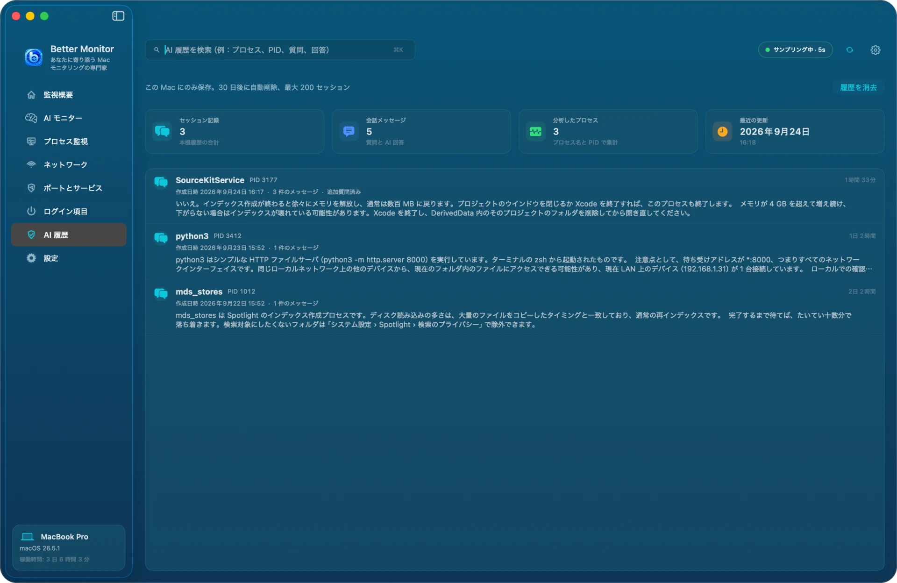

要約と追加質問はプロセスごとにこの Mac に保存され、30 日間、最大 200 件の会話まで保持されます。プロセス名、PID、質問、回答で検索でき、「履歴を消去」でまとめて削除できます。消去されるのはこの Mac の記録だけで、すでに AI サービスに送信したデータはそのサービスの保持・学習ポリシーに従います。

## メニューバー

Better Monitor の実行中は、メニューバーにアイコンが表示されます。クリックすると、CPU、メモリ、ストレージ、バッテリー、ネットワークの現在値と直近のグラフ、「Better Monitor を開く」「今すぐ更新」などのボタンを備えたパネルが開きます。

初期状態ではメニューバーにはアイコンだけが表示されます。「設定 › メニューバー」で「メニューバーのリアルタイムデータ」をオンにすると、CPU、メモリ、ネットワーク速度、温度、ディスクアクティビティをメニューバーに直接表示でき、コンパクト（最初に取得できた指標のみ）と詳細の 2 つのスタイルを選べます。下にプレビューが表示されます。

## 設定

設定は 7 つのカテゴリに分かれています。

**一般**：サンプリング間隔（1、2、5、10 秒）、プロセスリストの更新頻度、バックグラウンドデータの保持（1、3、7 日）、バックグラウンドのリアルタイムサンプリング。温度単位、ネットワーク速度の単位、パーセンテージの精度。デフォルト設定に戻す、診断レポートを書き出す。

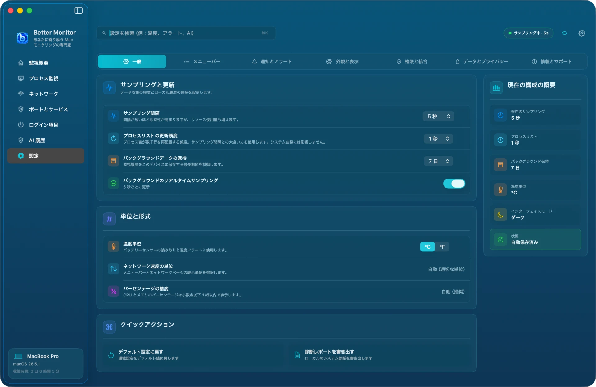

**メニューバー**：前の節を参照してください。

**通知とアラート**：システム通知のオン・オフ、高い CPU 使用率・高いメモリ使用率・バッテリー温度の各アラートのしきい値、通知方法（バナー、サウンド、無視）、サイレント時間帯。アラートは条件がしばらく続いたときにだけ通知されるため、一時的な変動では鳴りません。

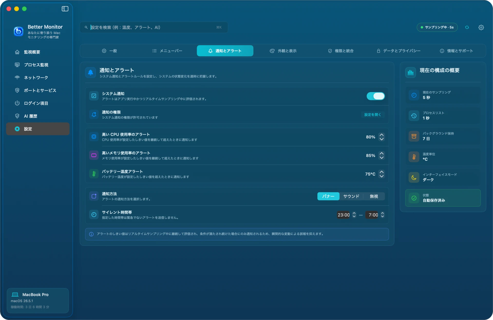

**外観と表示**：インターフェイス言語（简体中文、English、日本語、한국어、またはシステムに従う。切り替えはすぐに反映されます）、外観モード（システムに従う、ライト、ダーク）、アクセントカラー、チャートのアニメーション効果、数値形式。

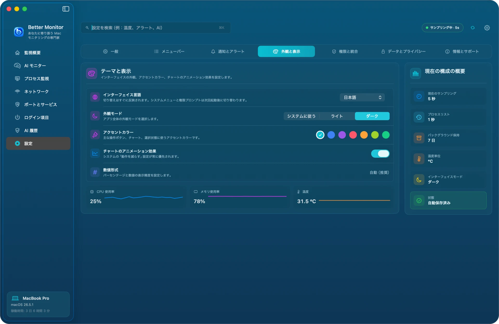

**権限と統合**：各システム権限の状態と許可画面への入口、ログイン時に開く、ショートカット対応のオン・オフ、AI サービスの管理、診断レポートの書き出し。

**データとプライバシー**：ローカルストレージの状態、期限切れデータの自動クリーンアップ、個人を特定できない形にした診断レポートの書き出し、ローカルデータを消去（監視履歴とローカルの AI 会話を完全に削除）、デフォルト設定に戻す（設定のみを戻し、履歴、AI データ、API キーは削除しません）。

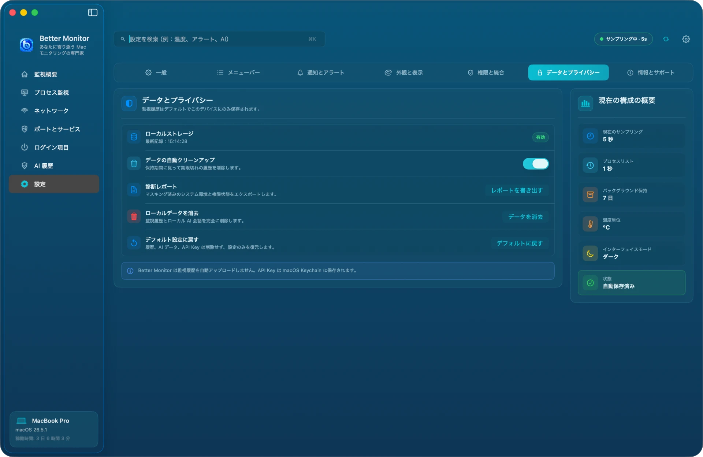

**情報とサポート**：アプリのバージョンと、ヘルプ、プライバシーポリシー、利用規約、サポートセンターへのリンク。

## ショートカット

Better Monitor は「ショートカット」App 向けに 3 つのアクションを提供します。

- Better Monitor を開く
- Better Monitor のサンプリングを一時停止
- Better Monitor のサンプリングを再開

たとえば集中モードやプレゼンテーションの前に、自動でサンプリングを止められます。ショートカットからサンプリングを操作されたくない場合は、「設定 › 権限と統合」で「ショートカット対応」をオフにします。

## プライバシーとローカルデータ

- 監視データはこの Mac 上で読み取り、保存されます。アカウントは不要で、自動でアップロードされることはありません。
- ネットワークに接続するのは次の 2 つの場合だけです：パブリック IP を手動で照会したとき、AI の要約や追加質問を依頼したとき（ご自身で設定したサービスに送信）。
- データの保存場所：
  - 監視履歴と AI 会話：`~/Library/Application Support/net.better.mac.monitor/`
  - 設定：`~/Library/Preferences/net.better.mac.monitor.plist`
  - AI の API キー：キーチェーンの `net.better.mac.monitor.ai` 項目
- 「設定 › データとプライバシー」からローカルデータを消去できます。AI サービスで構成を削除すると、対応する API キーも削除されます。

詳しくは[プライバシーポリシー](https://bettermac.net/en/privacy/)をご覧ください。

## よくある質問

**Wi-Fi 名が表示されない**
「システム設定 › プライバシーとセキュリティ › 位置情報サービス」で Better Monitor を許可してから、ネットワーク画面を更新してください。

**「ログイン項目」セグメントに何も表示されない**
このセグメントは System Events 経由で一覧を読み取ります。「システム設定 › プライバシーとセキュリティ › オートメーション」で Better Monitor に System Events の制御を許可し、ログイン項目の画面で更新してください。

**プロセスを終了できない**
システムプロセス、他のユーザーのプロセス、システム整合性保護の対象となっているプロセスは、一般のアプリからは終了できません。また Better Monitor はシグナルを送る直前にプロセスの識別情報を再確認し、PID が別のプロセスに再利用されていた場合は誤って終了しないよう操作を拒否します。

**ポートの所属プロセスが表示されない、値が「—」になる**
他のユーザーや root のプロセスについて、macOS が詳細を公開しないことがあります。「—」は現在読み取れないという意味で、0 という意味ではありません。

**グラフが空、または「サンプリング待機中」のまま**
上部バーで監視が一時停止していないか（⌘. で再開できます）、「設定 › 一般 › バックグラウンドのリアルタイムサンプリング」がオンになっているかを確認してください。

**Better Monitor 自体のリソース使用量は？**
プロセスリストとネットワークの一覧は、ウインドウが表示されていて必要なときにだけ更新されます。ウインドウを隠すと、軽量なシステム指標のサンプリングだけが続きます。「設定 › 一般」でサンプリング間隔を長くすると、さらに負荷を下げられます。

解決しない場合は、[サポートセンター](https://bettermac.net/en/support/?product=better-monitor)をご覧いただくか、[Issue を作成](https://github.com/BetterMacNet/better-monitor/issues/new?template=bug_report.md)してください。

## アンインストール

Homebrew でインストールした場合：

```bash
brew uninstall --cask better-monitor
# ローカルデータも削除する場合
brew uninstall --zap --cask better-monitor
```

手動でインストールした場合：Better Monitor を終了し、「アプリケーション」の `Better Monitor.app` をゴミ箱に入れます。データも削除する場合は、「[プライバシーとローカルデータ](#プライバシーとローカルデータ)」に記載したフォルダと設定ファイルを削除してください。`--zap` ではキーチェーンの API キーは削除されません。先に App で AI 構成を削除するか、「キーチェーンアクセス」で `net.better.mac.monitor.ai` を削除してください。
