# Better Monitor 사용 설명서

[English](usage.en.md) · [简体中文](usage.md) · [日本語](usage.ja.md) · 한국어

Better Monitor는 프로세스, 네트워크, 포트, 로그인 항목, 하드웨어 상태를 하나의 창에 모은 macOS용 시스템 모니터입니다. 평소 상태를 확인할 때도, 특정 문제를 추적할 때도 쓸 수 있습니다. 이 설명서는 1.0.2 버전을 기준으로 화면 순서대로 안내합니다.

> 이 설명서의 스크린샷은 데모 데이터로 만들었습니다. 기기 이름, 경로, IP 주소, 프로세스는 모두 가상의 값이며 실제 Mac과 관련이 없습니다.

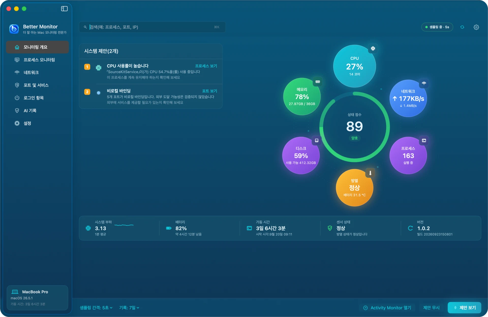

## 목차

1. [설치와 첫 실행](#설치와-첫-실행)
2. [권한 안내](#권한-안내)
3. [화면 구성과 키보드 단축키](#화면-구성과-키보드-단축키)
4. [모니터링 개요](#모니터링-개요)
5. [프로세스 모니터링](#프로세스-모니터링)
6. [네트워크](#네트워크)
7. [포트 및 서비스](#포트-및-서비스)
8. [로그인 항목](#로그인-항목)
9. [AI 프로세스 요약과 AI 기록](#ai-프로세스-요약과-ai-기록)
10. [메뉴 막대](#메뉴-막대)
11. [설정](#설정)
12. [단축어](#단축어)
13. [개인정보 보호와 로컬 데이터](#개인정보-보호와-로컬-데이터)
14. [자주 묻는 질문](#자주-묻는-질문)
15. [제거](#제거)

## 설치와 첫 실행

**시스템 요구 사항**: macOS 15(Sequoia) 이상. Apple 실리콘과 Intel Mac을 모두 지원하는 유니버설 바이너리입니다.

Homebrew로 설치:

```bash
brew install --cask bettermacnet/tap/better-monitor
```

또는 [GitHub Releases](https://github.com/BetterMacNet/better-monitor/releases/latest)에서 `BetterMonitor-1.0.2.dmg`를 내려받아 `Better Monitor.app`을 「응용 프로그램」 폴더로 드래그하세요. 모든 릴리스는 Developer ID로 서명되고 Apple의 공증을 받았으므로 처음 열 때 네트워크 확인이 필요하지 않습니다.

처음 실행하면 「약관 및 개인정보」가 표시됩니다. 로컬 우선으로 동작하고, 네트워크 조회는 직접 실행할 때만 이루어지며, macOS가 일부 작업을 거부할 수 있다는 내용입니다. 「동의하고 계속」을 선택하면 메인 창이 열리고, 「거부하고 종료」를 선택하면 아무것도 기록하지 않고 종료합니다.

메인 창이 열리면 Better Monitor는 5초 간격으로 샘플링을 시작하고 메뉴 막대에 아이콘을 추가합니다.

## 권한 안내

Better Monitor는 관리자 암호를 요구하지 않으며 시스템 확장 프로그램도 설치하지 않습니다. 아래 권한은 모두 선택 사항이며, 허용하지 않아도 나머지 기능은 그대로 쓸 수 있습니다.

| 권한 | 용도 | 허용하지 않으면 |
|---|---|---|
| 위치 서비스 | 현재 Wi-Fi 이름(SSID) 읽기. macOS는 Wi-Fi 이름을 읽을 때 이 권한을 요구합니다. Better Monitor는 위치를 읽거나 기록하지 않습니다 | Wi-Fi 이름이 표시되지 않으며, 나머지 네트워크 정보는 정상적으로 표시됩니다 |
| 자동화(System Events) | 「로그인 시 열기」 앱 목록 읽기 | 로그인 항목 세그먼트에 목록을 읽을 수 없다고 표시됩니다. LaunchAgents와 LaunchDaemons는 영향을 받지 않습니다 |
| 알림 | CPU, 메모리, 배터리 온도 알림 | 알림이 표시되지 않지만 모니터링은 계속됩니다 |
| 손쉬운 사용 | 창 정보 같은 확장 기능용이며, 기본 모니터링에는 쓰지 않습니다 | 영향 없음 |

각 권한의 상태는 「설정 › 권한 및 통합」에서 확인할 수 있고, 거기서 해당 시스템 설정 화면으로 이동할 수 있습니다.

또한 macOS는 모든 프로세스와 연결의 세부 정보를 일반 앱에 공개하지 않습니다. 다른 사용자의 프로세스나 시스템이 보호하는 프로세스는 경로, 열린 파일, 네트워크 소유 정보를 읽지 못할 수 있습니다. 이는 시스템의 제한이며 오류가 아닙니다.

## 화면 구성과 키보드 단축키

- **사이드바**: 모니터링 개요, 프로세스 모니터링, 네트워크, 포트 및 서비스, 로그인 항목, AI 기록, 설정의 7개 화면. 아래쪽 카드에 Mac 모델, macOS 버전, 가동 시간이 표시됩니다.
- **상단 막대**: 왼쪽은 현재 화면의 검색 필드, 오른쪽은 샘플링 상태(예: 「샘플링 중 · 5s」), 지금 새로고침, 설정 버튼입니다.
- **하단 막대**(모니터링 개요): 샘플링 간격과 기록 보관 기간을 바로 바꿀 수 있습니다.

| 단축키 | 동작 |
|---|---|
| ⌘K | 현재 화면의 검색 필드로 이동 |
| ⌘R | 지금 새로고침 |
| ⌘. | 모니터링 일시 중지 / 모니터링 계속 |
| ⌘, | 설정 열기 |

## 모니터링 개요

모니터링 개요는 「이 Mac은 지금 어떤 상태인가」를 빠르게 확인하는 화면입니다.

- **상태 점수**: 가운데 링이 CPU, 메모리 사용률, 메모리 압력, 디스크 사용률, 방열 상태를 바탕으로 100점 만점으로 점수를 매깁니다. 80점 이상은 「양호」, 60~79점은 「보통」, 그 미만은 「주의 필요」입니다.
- **6개 지표**: CPU(코어 수), 메모리(사용량 / 전체), 네트워크(업로드 / 다운로드 속도), 디스크(사용률과 여유 공간), 프로세스(실행 중인 수), 방열(시스템 방열 상태와 배터리 온도).
- **제안**: 살펴볼 만한 상황을 왼쪽에 보여 줍니다. 예: CPU 사용률이 높은 프로세스, 높은 메모리 압력, 부족한 디스크 공간, 높은 방열 압력, 비로컬 바인딩을 쓰는 포트, 높은 네트워크 트래픽이나 많은 연결 수. 각 제안에는 「프로세스 보기」「포트 보기」처럼 해당 화면으로 이동하는 버튼이 있습니다.
- **상태 표시줄**: 시스템 부하, 배터리 잔량과 남은 시간, 가동 시간과 부팅 시각, 센서 상태, 앱 버전.
- **하단 막대**: 「제안 보기」는 제안 목록을 열어 하나씩 확인하게 해 줍니다. 「제안 무시」는 현재 제안을 24시간 동안 숨깁니다. 「Activity Monitor 열기」는 macOS에 기본으로 있는 활성 상태 보기를 엽니다.

라이트 모드의 모니터링 개요:

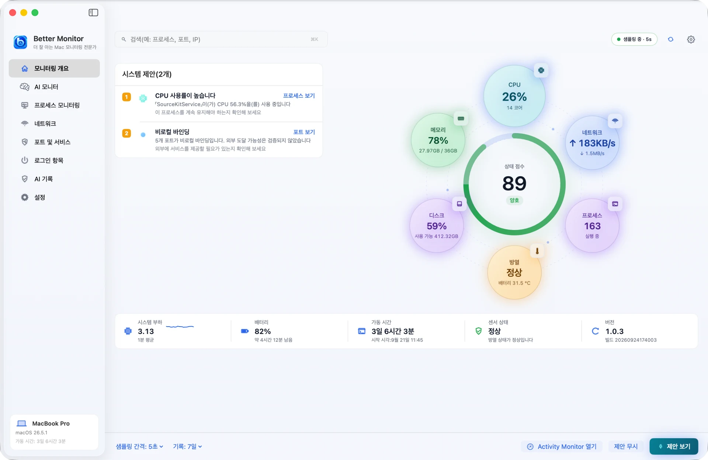

## 프로세스 모니터링

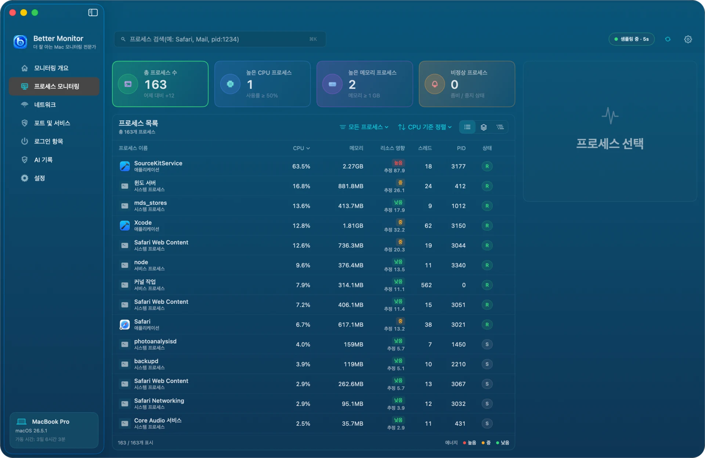

**상단의 카드 4개**: 총 프로세스 수(전일 대비 변화), 높은 CPU 프로세스(50% 이상), 높은 메모리 프로세스(1GB 이상), 비정상 프로세스(좀비 또는 정지 상태). 카드를 클릭하면 해당 프로세스만 보여 주고, 다시 클릭하면 필터가 해제됩니다.

**프로세스 목록**:

- 세 가지 보기: **전체 프로세스**는 하나씩 나열하고, **집계 보기**는 한 앱의 여러 프로세스(예: Safari의 웹 콘텐츠 프로세스)를 한 그룹으로 묶으며, **프로세스 트리**는 부모와 자식 관계에 따라 펼칩니다.
- 「모든 프로세스」 메뉴로 범주(애플리케이션, 시스템 프로세스, 서비스 프로세스 등)를 거르고, 정렬 메뉴로 CPU, 메모리, 리소스 영향, 스레드 수, PID 등의 순서로 정렬합니다.
- 「리소스 영향」은 현재 CPU와 상주 메모리로 계산한 로컬 추정치이며 높음, 중간, 낮음의 세 단계입니다. 빠르게 정렬하기 위한 기준이며 전력 소비를 정확히 측정한 값이 아닙니다.
- 상태 열의 R은 실행 중, S는 대기 중을 뜻합니다.

**프로세스를 선택**하면 오른쪽에 사용량 그래프, 경로, 기본 정보가 나타나고 「세부정보 보기」「프로세스 종료」「관찰에 추가」를 할 수 있습니다. 관찰에 추가한 프로세스는 실행 파일 경로로 식별하므로, 다시 시작해서 PID가 바뀌어도 계속 추적합니다.

**프로세스 세부정보**:

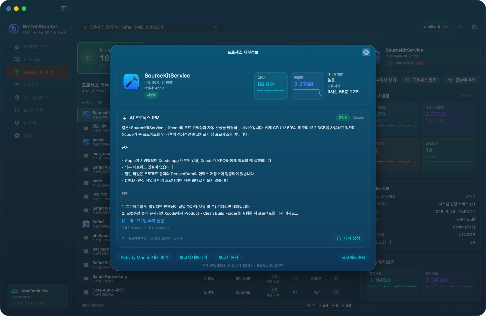

세부정보 창에는 다음이 표시됩니다.

- 식별 정보: 이름, 버전, 개발자, 코드 서명 상태
- AI 프로세스 요약(아래 참고, AI 서비스 설정 필요)
- 실행 파일 경로
- CPU, 메모리, 스레드, 디스크 읽기·쓰기와 최근 그래프
- 상위 프로세스, 사용자, 시작 시간, 실행 시간
- 열린 파일(시스템의 파일 디스크립터 테이블에서 읽으며, 메모리에 매핑된 라이브러리는 포함하지 않음)

아래쪽에서 「Activity Monitor에서 보기」「보고서 내보내기」「보고서 복사」「프로세스 종료」를 실행할 수 있습니다. 종료하기 전에 확인을 거치며, 프로세스에서 저장하지 않은 데이터가 사라질 수 있다고 알려 줍니다. 시스템 프로세스와 다른 사용자의 프로세스는 보통 종료할 수 없으며, 이는 macOS 권한에 따른 제한입니다.

## 네트워크

네트워크 화면에는 「네트워크 정보」와 「네트워크 활동」 두 개의 탭이 있습니다.

### 네트워크 정보

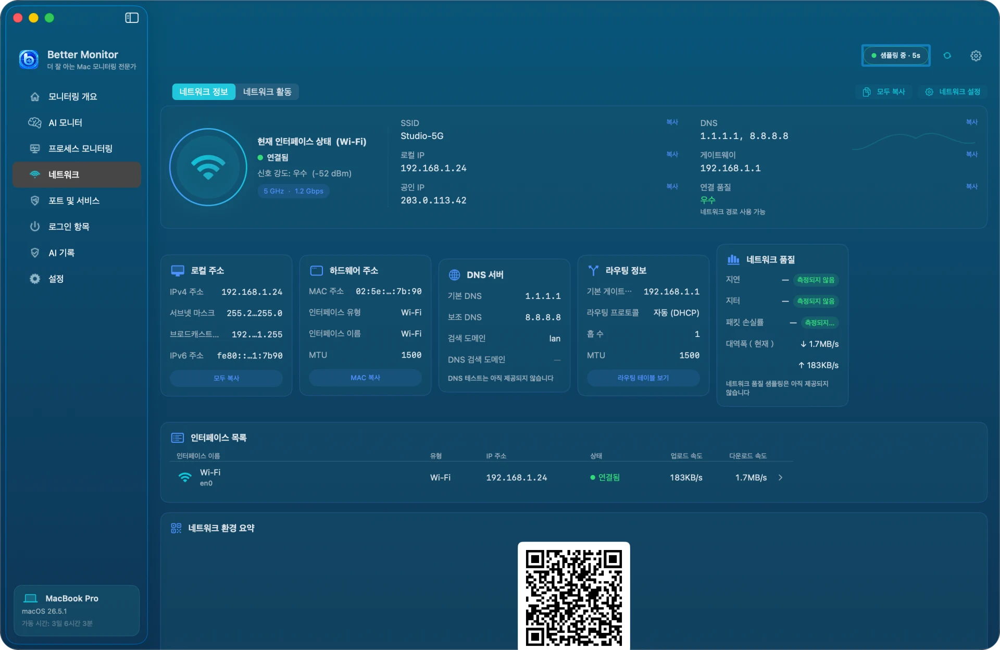

- 현재 인터페이스 상태: 유형, 연결 상태, 신호 강도, 주파수 대역과 링크 속도
- SSID(위치 서비스 권한 필요), 로컬 IP, 공인 IP, DNS, 게이트웨이, 연결 품질
- 로컬 주소, 하드웨어 주소, DNS 서버, 라우팅 정보, 네트워크 품질의 카드 5개와 모든 활성 인터페이스 목록
- 오른쪽 위의 「모두 복사」는 이 정보를 텍스트로 복사하고, 「네트워크 설정」은 시스템의 네트워크 설정을 엽니다.

**공인 IP는 처음에 「조회하지 않음」으로 표시되며, 클릭했을 때만 네트워크로 조회합니다.** AI 요약을 제외하면 Better Monitor가 외부로 보내는 요청은 이것뿐입니다.

### 네트워크 활동

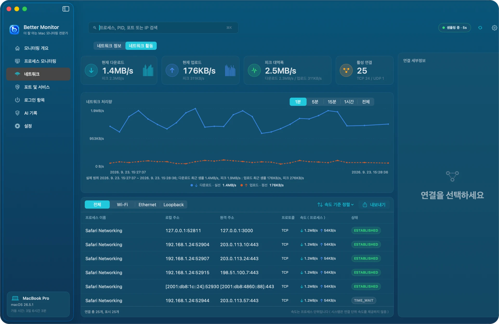

- 상단: 현재 다운로드, 현재 업로드, 피크 대역폭, 활성 연결 수(TCP / UDP)
- 네트워크 처리량 그래프는 1분, 5분, 15분, 1시간, 전체로 전환할 수 있습니다. 1시간과 전체는 로컬 기록을 사용하며 업로드와 다운로드를 합친 속도만 보관합니다.
- 연결 목록은 전체, Wi-Fi, Ethernet, Loopback으로 거를 수 있고 프로세스, 로컬 주소, 원격 주소, 프로토콜, 속도, TCP 상태를 보여 줍니다. 속도순 정렬과 내보내기를 지원합니다.
- 연결을 선택하면 오른쪽 「연결 세부정보」에 전체 정보가 나타납니다.

참고: macOS는 연결별 속도를 제공하지 않으므로, 목록의 「속도」는 그 연결이 속한 프로세스 전체의 속도입니다.

## 포트 및 서비스

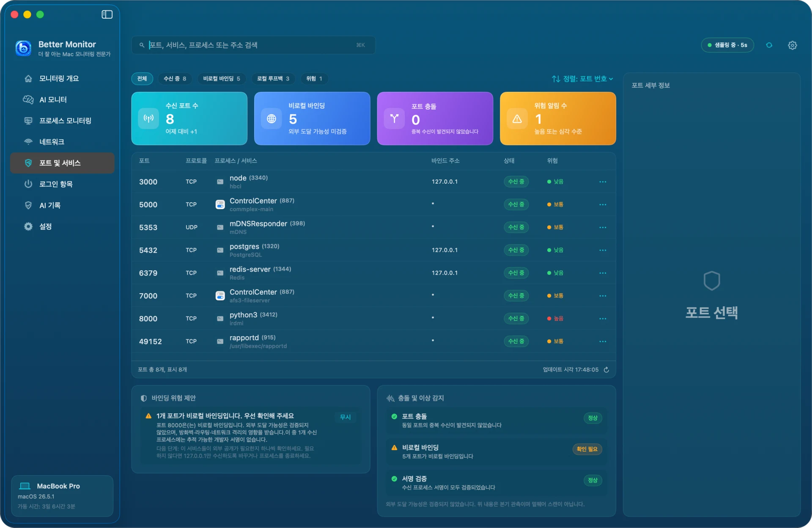

이 화면에서는 「이 Mac이 어떤 포트에서 수신 대기하고 있고, 그것이 누구의 것이며, 외부에 노출되어 있지 않은가」를 확인합니다.

- 상단 필터: 전체, 수신 중, 비로컬 바인딩, 로컬 루프백, 위험
- 카드 4개: 수신 포트 수(전일 대비 변화), 비로컬 바인딩, 포트 충돌, 위험 알림 수
- 목록에는 포트, 프로토콜, 프로세스와 서비스 이름, 바인딩 주소, 상태, 위험 수준이 표시됩니다. 행 끝의 「⋯」에서 「포트 정보 복사」「Finder에서 실행 파일 보기」「프로세스 종료」를 할 수 있습니다.
- 「바인딩 위험 제안」은 해당 포트가 위험으로 표시된 이유와 다음 조치(예: 127.0.0.1에서만 수신하도록 변경)를 설명합니다.
- 「충돌 및 이상 감지」는 중복 수신, 비로컬 바인딩, 수신 프로세스의 서명을 점검합니다.

바인딩 주소의 의미: `127.0.0.1` 또는 `::1`은 이 Mac에서만 접근할 수 있고, `*`, `0.0.0.0`, `::`은 모든 네트워크 인터페이스에서 수신합니다. **비로컬 바인딩은 확인해 볼 신호일 뿐, 실제로 외부에서 접근할 수 있다는 증거는 아닙니다.** 방화벽, 라우터, 네트워크 격리도 접근 가능 여부에 영향을 줍니다. Better Monitor는 포트를 스캔하지 않으며 보안 감사 도구도 아닙니다. macOS에 기본으로 있는 AirPlay 수신기(포트 5000, 7000) 같은 서비스는 원래 모든 인터페이스에서 수신하도록 되어 있어 보통 조치할 필요가 없습니다.

## 로그인 항목

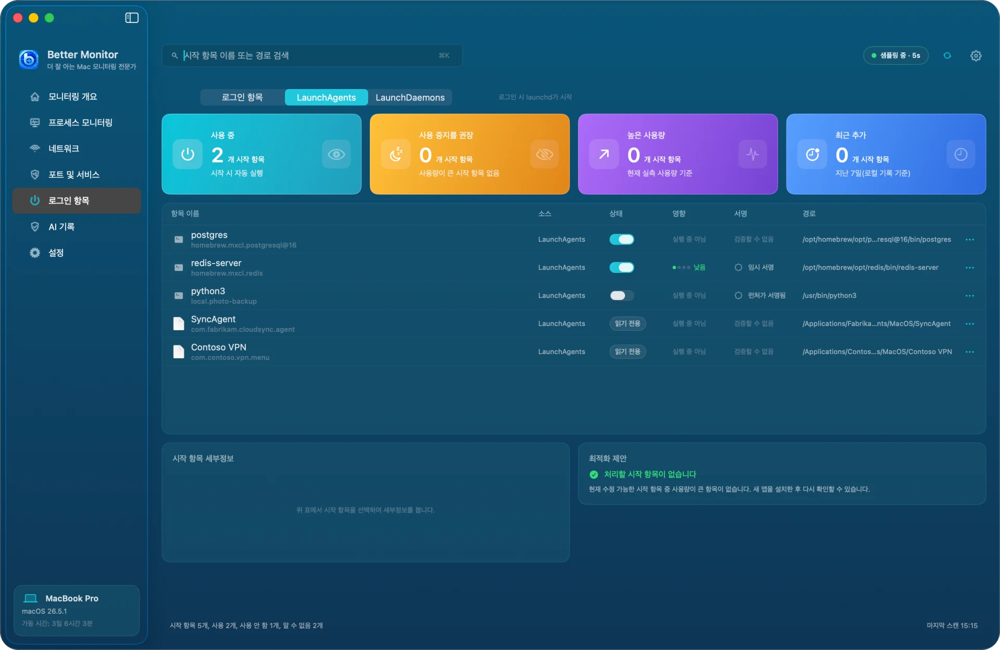

이 화면은 로그인 후 자동으로 실행되는 항목을 세 개의 세그먼트로 모아 보여 줍니다.

- **로그인 항목**: 「시스템 설정 › 일반 › 로그인 항목 및 확장 프로그램」의 「로그인 시 열기」에 등록된 앱. macOS가 관리하므로 여기서는 읽기 전용이며, 「시스템 로그인 항목 열기」로 시스템 설정에서 바꿉니다.
- **LaunchAgents**: 로그인할 때 launchd가 실행합니다. 내 `~/Library/LaunchAgents` 폴더에 있는 항목은 여기서 바로 켜고 끌 수 있고, `/Library/LaunchAgents`의 시스템 전체 항목은 읽기 전용입니다.
- **LaunchDaemons**: 부팅 시 시스템 권한으로 실행됩니다. 읽기 전용입니다.

카드 4개: 사용 중, 사용 중지를 권장, 높은 사용량, 최근 추가(이 Mac에서 처음 발견한 시점 기준). 목록의 「영향」은 해당 항목 프로세스의 **현재** 리소스 사용량이며 부팅 시간이 아닙니다. 사용을 중지해도 반드시 리소스가 절약되는 것은 아닙니다. 한 프로그램이 여러 프로세스로 실행될 때(예: PostgreSQL)는 어느 것이 해당 항목인지 알 수 없어 「실행 중 아님」으로 표시됩니다. 서명 열에는 「서명 유효」「임시 서명」「검증할 수 없음」 같은 상태가 표시됩니다. 스크립트 인터프리터(python, node, bash 등)로 실행되는 항목은 「런처가 서명됨」으로 표시되어, 실제로 실행되는 것은 스크립트라는 점을 알려 줍니다.

## AI 프로세스 요약과 AI 기록

AI 기능은 선택 사항입니다. 설정하지 않아도 모든 모니터링 기능을 쓸 수 있습니다.

**설정**: 「설정 › 권한 및 통합 › AI 서비스 › 관리」를 열어 AI API 구성을 추가합니다.

- 인터페이스 유형: Anthropic 또는 OpenAI Chat Completions 호환 서비스
- 이름, Endpoint(HTTPS 필수), 모델
- API 키는 macOS 키체인에 저장됩니다. 편집할 때 비워 두면 기존 키를 그대로 씁니다.

여러 구성을 저장해 두고 「현재 구성으로 설정」으로 사용할 구성을 고를 수 있습니다.

**요약 생성**: 프로세스 세부정보를 열고 「AI 프로세스 요약」 카드에서 생성합니다. 처음에는 「프로세스 세부 정보를 AI 서비스로 보낼까요?」가 표시되며, 보낼 내용(프로세스의 전체 경로, PID, 리소스와 네트워크 관측값, 열린 파일의 경로)을 알려 줍니다. **파일 내용, 다른 프로세스의 정보, API 키는 보내지 않습니다.** 「동의하고 생성」을 선택하기 전에는 아무것도 전송되지 않습니다.

요약이 나오면 「더 보기 및 추가 질문」으로 그 프로세스에 대해 계속 질문할 수 있고, 「다시 생성」으로 요약을 새로 만들 수 있습니다. AI의 결론은 이해를 돕는 참고 자료이며 보안이나 성능 진단이 아닙니다. 최종 판단은 직접 내려 주세요.

**AI 기록**:

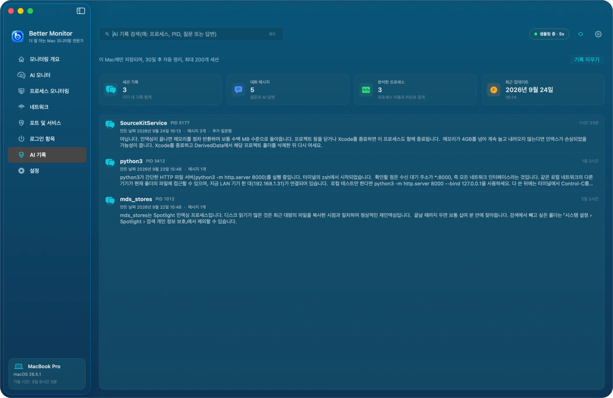

요약과 추가 질문은 프로세스별로 이 Mac에 저장되며 30일 동안, 최대 200개 대화까지 보관됩니다. 프로세스 이름, PID, 질문, 답변으로 검색할 수 있고 「기록 지우기」로 한 번에 삭제할 수 있습니다. 삭제되는 것은 이 Mac의 기록뿐이며, 이미 AI 서비스로 보낸 데이터는 해당 서비스의 보관 및 학습 정책을 따릅니다.

## 메뉴 막대

Better Monitor가 실행 중이면 메뉴 막대에 아이콘이 표시됩니다. 아이콘을 클릭하면 CPU, 메모리, 저장 공간, 배터리, 네트워크의 현재 값과 최근 그래프, 「Better Monitor 열기」「지금 새로고침」 같은 버튼이 있는 패널이 열립니다.

기본적으로 메뉴 막대에는 아이콘만 표시됩니다. 「설정 › 메뉴 막대」에서 「메뉴 바 실시간 데이터」를 켜면 CPU, 메모리, 네트워크 속도, 온도, 디스크 활동을 메뉴 막대에 바로 표시할 수 있고, 컴팩트(처음으로 사용할 수 있는 지표만 표시)와 상세 두 가지 스타일 중에서 고를 수 있습니다. 아래에 미리보기가 표시됩니다.

## 설정

설정은 7개 분류로 나뉩니다.

**일반**: 샘플링 간격(1, 2, 5, 10초), 프로세스 목록 새로고침 빈도, 백그라운드 데이터 보관(1, 3, 7일), 백그라운드 실시간 샘플링. 온도 단위, 네트워크 속도 단위, 백분율 정밀도. 기본 설정으로 복원, 진단 보고서 내보내기.

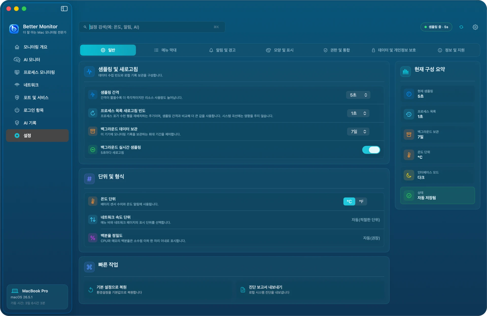

**메뉴 막대**: 앞 절을 참고하세요.

**알림 및 경고**: 시스템 알림 켜기·끄기, 높은 CPU 사용률·높은 메모리 사용률·배터리 온도 알림의 기준값, 알림 방식(배너, 소리, 무시), 방해 금지 시간. 알림은 조건이 한동안 계속될 때만 보내므로 순간적인 변동으로는 울리지 않습니다.

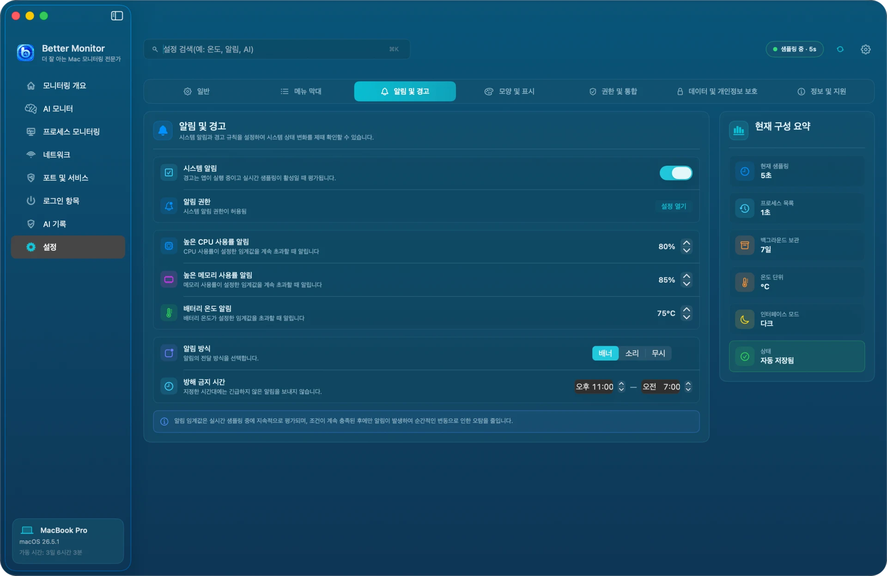

**모양 및 표시**: 인터페이스 언어(简体中文, English, 日本語, 한국어 또는 시스템 설정을 따름. 바꾸면 바로 적용됨), 모양 모드(시스템 설정, 라이트, 다크), 강조색, 차트 애니메이션 효과, 숫자 형식.

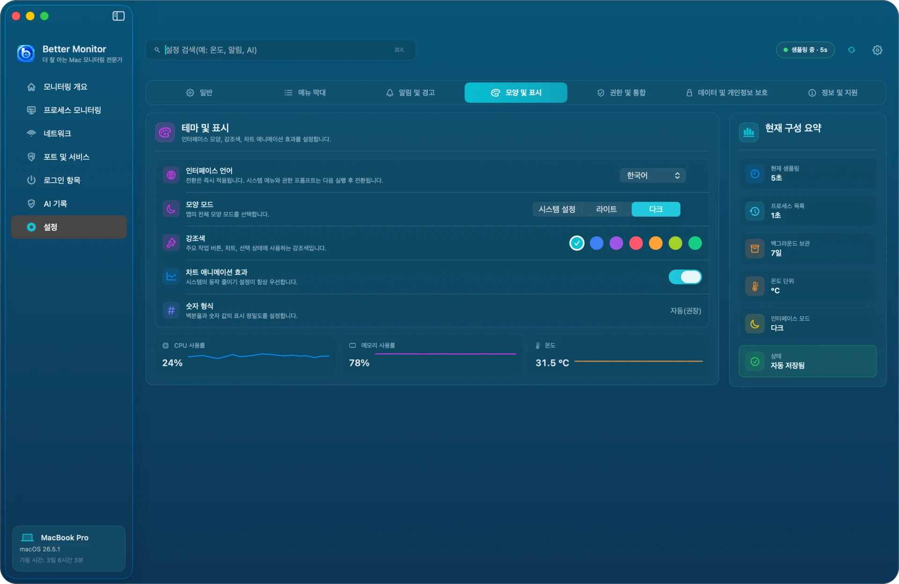

**권한 및 통합**: 각 시스템 권한의 상태와 허용 화면으로 가는 입구, 로그인 시 열기, 단축어 지원 켜기·끄기, AI 서비스 관리, 진단 보고서 내보내기.

**데이터 및 개인정보 보호**: 로컬 저장소 상태, 만료된 데이터 자동 정리, 식별 정보를 제거한 진단 보고서 내보내기, 로컬 데이터 지우기(모니터링 기록과 로컬 AI 대화를 영구 삭제), 기본 설정으로 복원(설정만 되돌리며 기록, AI 데이터, API 키는 삭제하지 않음).

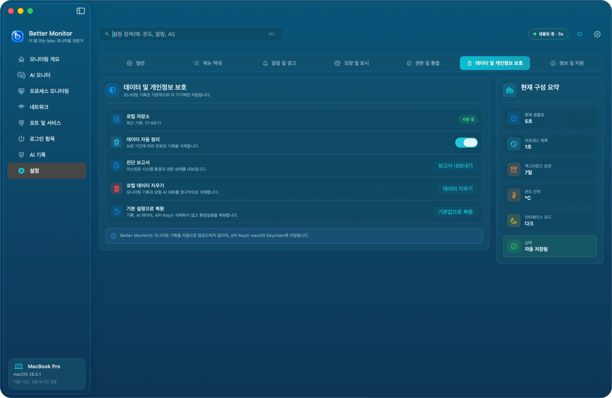

**정보 및 지원**: 앱 버전과 도움말, 개인정보 처리방침, 이용 약관, 고객지원 센터 링크.

## 단축어

Better Monitor는 「단축어」 앱에 세 가지 동작을 제공합니다.

- Better Monitor 열기
- Better Monitor 샘플링 일시 중지
- Better Monitor 샘플링 재개

예를 들어 집중 모드를 켜거나 발표를 시작하기 전에 샘플링을 자동으로 멈출 수 있습니다. 단축어가 샘플링을 제어하지 않게 하려면 「설정 › 권한 및 통합」에서 「단축어 지원」을 끄세요.

## 개인정보 보호와 로컬 데이터

- 모니터링 데이터는 이 Mac에서만 읽고 저장합니다. 계정이 필요 없고 자동으로 업로드되지 않습니다.
- 네트워크에 연결하는 경우는 두 가지뿐입니다. 공인 IP를 직접 조회할 때, 그리고 AI 요약이나 추가 질문을 요청할 때(직접 설정한 서비스로 전송)입니다.
- 데이터 위치:
  - 모니터링 기록과 AI 대화: `~/Library/Application Support/net.better.mac.monitor/`
  - 설정: `~/Library/Preferences/net.better.mac.monitor.plist`
  - AI API 키: 키체인의 `net.better.mac.monitor.ai` 항목
- 「설정 › 데이터 및 개인정보 보호」에서 로컬 데이터를 지울 수 있습니다. AI 서비스에서 구성을 삭제하면 해당 API 키도 함께 삭제됩니다.

자세한 내용은 [개인정보 처리방침](https://bettermac.net/en/privacy/)을 확인하세요.

## 자주 묻는 질문

**Wi-Fi 이름이 표시되지 않아요**
「시스템 설정 › 개인정보 보호 및 보안 › 위치 서비스」에서 Better Monitor를 허용한 뒤 네트워크 화면을 새로고침하세요.

**「로그인 항목」 세그먼트에 아무것도 나오지 않아요**
이 세그먼트는 System Events를 통해 목록을 읽습니다. 「시스템 설정 › 개인정보 보호 및 보안 › 자동화」에서 Better Monitor가 System Events를 제어하도록 허용한 뒤 로그인 항목 화면을 새로고침하세요.

**프로세스를 종료할 수 없어요**
시스템 프로세스, 다른 사용자의 프로세스, 시스템 무결성 보호 대상 프로세스는 일반 앱이 종료할 수 없습니다. 또한 Better Monitor는 신호를 보내기 직전에 프로세스 식별 정보를 다시 확인하며, PID가 다른 프로세스에 재사용되었으면 잘못된 프로세스를 종료하지 않도록 작업을 거부합니다.

**포트의 소유 프로세스가 보이지 않거나 값이 「—」로 나와요**
다른 사용자나 root의 프로세스는 macOS가 세부 정보를 공개하지 않을 수 있습니다. 「—」는 지금 읽을 수 없다는 뜻이며 0이라는 뜻이 아닙니다.

**그래프가 비어 있거나 「샘플 대기 중」에서 멈춰 있어요**
상단 막대에서 모니터링이 일시 중지되어 있지 않은지(⌘.로 재개), 「설정 › 일반 › 백그라운드 실시간 샘플링」이 켜져 있는지 확인하세요.

**Better Monitor 자체는 리소스를 얼마나 쓰나요?**
프로세스 목록과 네트워크 목록은 창이 보이고 필요할 때만 새로고침합니다. 창을 숨기면 가벼운 시스템 지표 샘플링만 계속됩니다. 「설정 › 일반」에서 샘플링 간격을 늘리면 부담을 더 줄일 수 있습니다.

그래도 해결되지 않으면 [고객지원 센터](https://bettermac.net/en/support/?product=better-monitor)를 방문하거나 [Issue를 등록](https://github.com/BetterMacNet/better-monitor/issues/new?template=bug_report.md)해 주세요.

## 제거

Homebrew로 설치한 경우:

```bash
brew uninstall --cask better-monitor
# 로컬 데이터까지 삭제하려면
brew uninstall --zap --cask better-monitor
```

직접 설치한 경우: Better Monitor를 종료하고 「응용 프로그램」의 `Better Monitor.app`을 휴지통으로 옮기세요. 데이터도 지우려면 「[개인정보 보호와 로컬 데이터](#개인정보-보호와-로컬-데이터)」에 적힌 폴더와 설정 파일을 삭제하세요. `--zap`은 키체인의 API 키를 삭제하지 않습니다. 먼저 앱에서 AI 구성을 삭제하거나 「키체인 접근」에서 `net.better.mac.monitor.ai`를 삭제하세요.
