# Better Monitor 使用说明

[English](usage.en.md) · 简体中文 · [日本語](usage.ja.md) · [한국어](usage.ko.md)

Better Monitor 把进程、网络、端口、登录项和硬件状态放进同一个窗口，适合日常查看，也适合有针对性地排查问题。本说明对应 1.0.3 版本，按界面从上到下逐页介绍。

> 本文截图使用演示数据生成，其中的设备名、路径、IP 地址和进程都是虚构的，不对应任何真实设备。

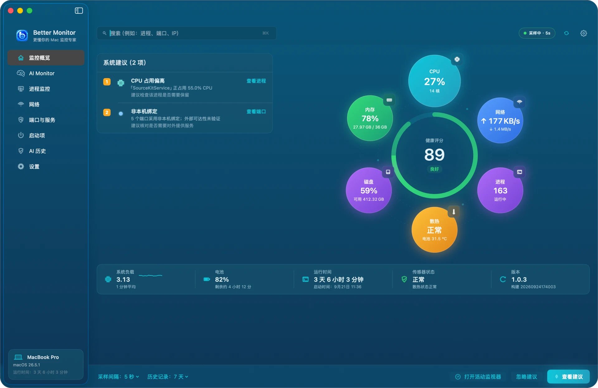

## 目录

1. [安装与首次启动](#安装与首次启动)
2. [权限说明](#权限说明)
3. [界面结构与快捷键](#界面结构与快捷键)
4. [监控概览](#监控概览)
5. [AI Monitor](#ai-monitor)
6. [进程监控](#进程监控)
7. [网络](#网络)
8. [端口与服务](#端口与服务)
9. [启动项](#启动项)
10. [AI 进程总结与 AI 历史](#ai-进程总结与-ai-历史)
11. [菜单栏](#菜单栏)
12. [设置](#设置)
13. [快捷指令](#快捷指令)
14. [隐私与本地数据](#隐私与本地数据)
15. [常见问题](#常见问题)
16. [卸载](#卸载)

## 安装与首次启动

**系统要求**：macOS 15（Sequoia）或更高版本，Apple 芯片和 Intel Mac 都支持（通用二进制）。

用 Homebrew 安装：

```bash
brew install --cask bettermacnet/tap/better-monitor
```

或者从 [GitHub Releases](https://github.com/BetterMacNet/better-monitor/releases/latest) 下载 `BetterMonitor-1.0.3.dmg`，把 `Better Monitor.app` 拖进「应用程序」文件夹。每个发布版本都用 Developer ID 签名并经过 Apple 公证，首次打开不需要联网验证。

第一次启动会先显示「使用条款与隐私」，列出本地优先、仅手动触发的联网查询、操作可能被系统拒绝等事项。点「同意并继续」进入主窗口；点「拒绝并退出」则直接退出，不会记录任何数据。

进入主窗口后，Better Monitor 立即开始按 5 秒间隔采样，同时在菜单栏放一个图标。

## 权限说明

Better Monitor 不需要管理员密码，也不安装任何系统扩展。下面几项权限都是可选的，不授权也能使用其余功能：

| 权限 | 用途 | 不授权时 |
|---|---|---|
| 定位服务 | 读取当前 Wi-Fi 名称（SSID）。macOS 规定读 Wi-Fi 名称必须有这项授权，Better Monitor 不读取也不记录你的位置 | Wi-Fi 名称显示为不可用，其余网络信息正常 |
| 自动化（System Events） | 读取「登录时打开」的登录项清单 | 登录项分段提示读取不到；LaunchAgents 与 LaunchDaemons 不受影响 |
| 通知 | 发送 CPU、内存、电池温度告警 | 告警不会弹出，监控照常进行 |
| 辅助功能 | 仅为窗口信息等扩展能力预留，核心监控不依赖 | 无影响 |

各项权限的当前状态可以在「设置 › 权限与集成」查看，并从那里跳到对应的系统设置页面。

另外，macOS 不会把所有进程和连接的细节都开放给普通应用。属于其他用户或受系统保护的进程，可能读不到路径、打开的文件或网络归属，这是系统限制，不是故障。

## 界面结构与快捷键

- **侧边栏**：监控概览、AI Monitor、进程监控、网络、端口与服务、启动项、AI 历史、设置八个页面。底部卡片显示本机型号、macOS 版本和开机时长。
- **顶栏**：左侧是当前页面的搜索框；右侧是采样状态（例如「采样中 · 5s」）、立即刷新和设置按钮。
- **底栏**（概览页）：可以直接修改采样间隔和历史保留天数。

| 快捷键 | 作用 |
|---|---|
| ⌘K | 聚焦当前页面的搜索框 |
| ⌘R | 立即刷新 |
| ⌘. | 暂停监控 / 继续监控 |
| ⌘, | 打开设置 |

## 监控概览

概览页用来快速回答「这台 Mac 现在怎么样」。

- **健康评分**：中间的圆环根据 CPU、内存使用率、内存压力、磁盘占用和散热状态打分，满分 100；80 分及以上为「良好」，60–79 为「一般」，更低为「需关注」。
- **六个指标球**：CPU（附核心数）、内存（已用 / 总量）、网络（上行 / 下行速率）、磁盘（使用率与可用空间）、进程（运行中的数量）、散热（系统散热状态与电池温度）。
- **系统建议**：发现需要注意的情况时列在左侧，例如某个进程 CPU 占用偏高、内存压力较大、磁盘空间不足、散热压力偏高、有端口采用非本机绑定、网络流量偏高或连接数较多。每条建议都带有跳转按钮（「查看进程」「查看端口」等）。
- **状态条**：系统负载、电池电量与剩余时间、运行时间与开机时间、传感器状态、应用版本。
- **底栏**：「查看建议」弹出建议清单，可以逐条前往排查；「忽略建议」把当前的建议静默 24 小时；「打开活动监视器」直接打开 macOS 自带的活动监视器。

浅色外观下的概览页：

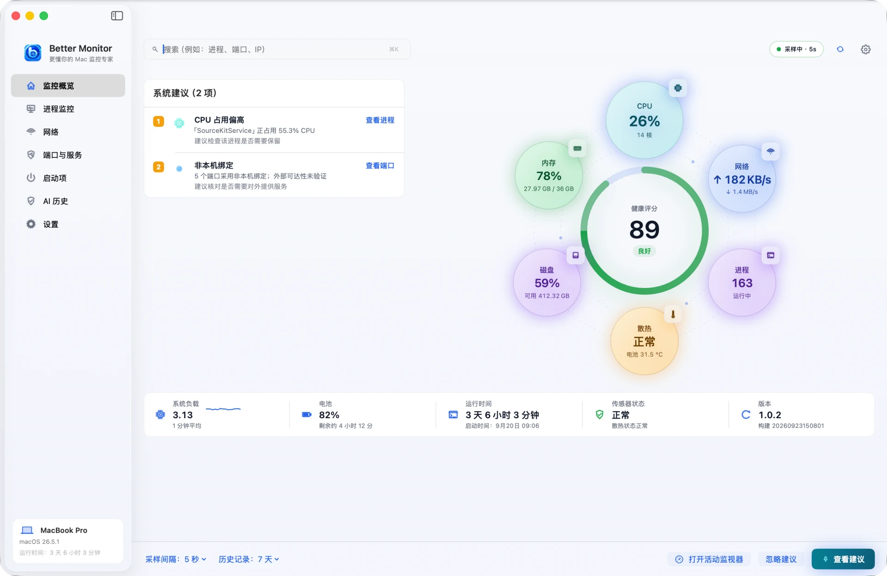

## AI Monitor

AI Monitor 细看 Apple 芯片正在做什么，以及本地 AI 模型跑在哪里。它在侧边栏「监控概览」下方，需要 Apple 芯片的 Mac。

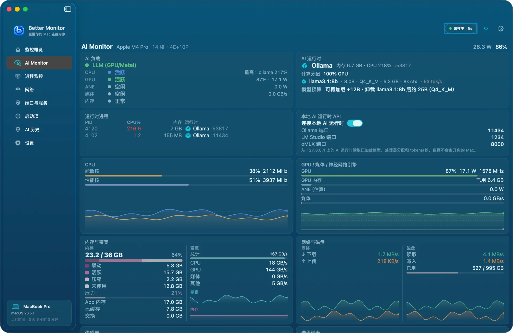

- **AI 负载**：一句话判断当前工作是什么——GPU（Metal）上的 LLM、神经网络引擎上的 Core ML、媒体引擎上的视频，还是空闲——并列出 CPU、GPU、神经网络引擎、媒体引擎和内存各自的状态与读数。
- **AI 运行时**：按进程识别 Ollama、LM Studio、MLX、llama.cpp 等本地运行时，显示其内存与 CPU 占用，以及模型预算（内存里还能放下的最大模型）。
- **运行时进程** 与 **本地 AI 运行时 API**：列出检测到的全部运行时进程。开启「连接本地 AI 运行时」后，会从 127.0.0.1 上的运行时 API 读取已加载模型、GPU/CPU 分配和 tokens/秒，数据不会离开你的 Mac。Better Monitor 不会启动运行时，也不会扫描端口。
- **CPU** 与 **GPU / 媒体 / 神经网络引擎**：能效核与性能核的占用和频率，GPU 占用、功耗与内存，神经网络引擎功耗，媒体引擎带宽，各带一分钟趋势。芯片因散热降频时，对应卡片的边框会变红。
- **内存与带宽**、**网络与磁盘**：内存组成与压力、统一内存带宽、网络与磁盘速率。
- **传感器** 与 **进程列表**：风扇转速和按分组的温度传感器。进程列表可筛选、排序，点按进程可打开单进程详情（CPU、IPC、能耗、内存、神经网络引擎内存）。结束与强制结束沿用「进程监控」的安全校验。

AI Monitor 只在页面显示时采样，暂停监控时也会停止。部分芯片只提供内存带宽总量，这时 CPU / GPU / 媒体分项显示为 0。

## 进程监控

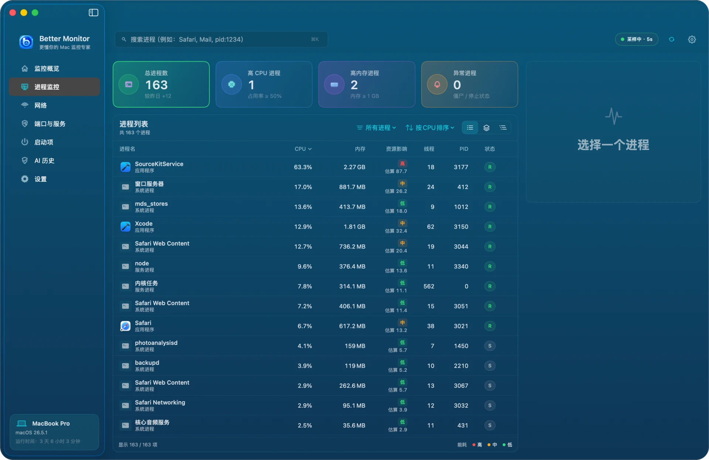

**顶部四张卡片**：总进程数（附较昨日的变化）、高 CPU 进程（占用 ≥ 50%）、高内存进程（内存 ≥ 1 GB）、异常进程（僵尸或已停止）。点一张卡片即可只看对应的进程，再点一次取消筛选。

**进程列表**：

- 三种视图：**全部进程**逐个列出；**聚合视图**把同一个 App 的多个进程（例如 Safari 的网页内容进程）合并成一组；**进程树**按父子关系展开。
- 「所有进程」菜单按类别筛选（应用程序、系统进程、服务进程等）；排序菜单支持 CPU、内存、资源影响、线程数、PID 等。
- 「资源影响」是基于当前 CPU 和常驻内存的本地估算，分为高、中、低三档，用来快速排序，不代表耗电的精确测量。
- 状态列：R 表示运行中，S 表示休眠。

**选中一个进程**后，右侧显示它的使用情况曲线、路径和基本信息，可以「查看详情」「结束进程」或「加入观察」。加入观察的进程按可执行文件路径识别，重启后 PID 变了也能继续跟踪。

**进程详情**：

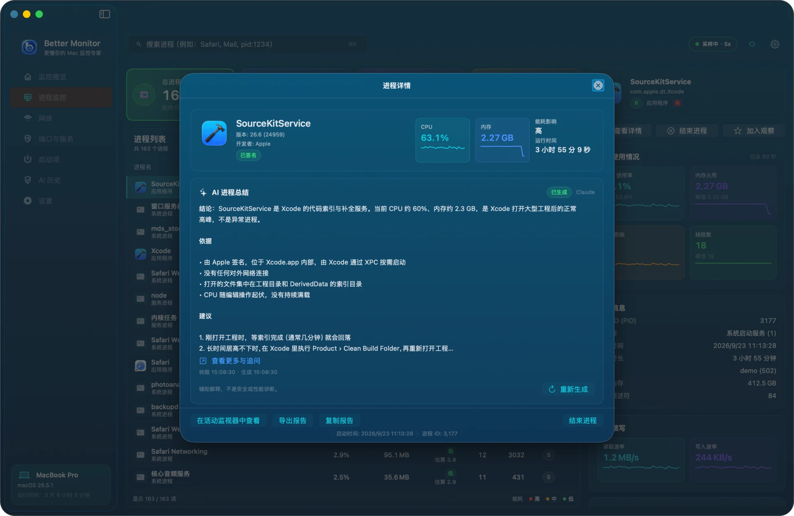

详情窗口包括：

- 身份：名称、版本、开发者、代码签名状态；
- AI 进程总结（见下文，需先配置 AI 服务）；
- 可执行文件路径；
- CPU、内存、线程、磁盘读写等使用情况，以及过去一段时间的曲线；
- 父进程、用户、启动时间、运行时长；
- 打开的文件（来自系统的文件描述符表，不包括内存映射的库）。

底部可以「在活动监视器中查看」「导出报告」「复制报告」，或者「结束进程」。结束前会弹出确认，并提醒进程中未保存的数据可能丢失。系统进程和其他用户的进程通常无法结束，这是 macOS 的权限限制。

## 网络

网络页分为「网络信息」和「网络活动」两个子页。

### 网络信息

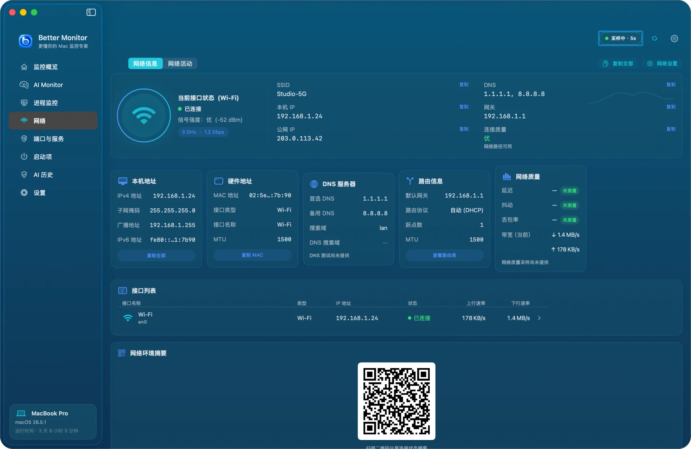

- 当前接口状态：接口类型、是否已连接、信号强度、频段与速率；
- SSID（需要定位服务授权）、本机 IP、公网 IP、DNS、网关、连接质量；
- 本机地址、硬件地址、DNS 服务器、路由信息、网络质量五张卡片，以及所有活动接口的列表；
- 右上角「复制全部」把这些信息复制为文本，「网络设置」打开系统的网络设置。

**公网 IP 默认显示「未查询」，只在你点击它时才联网获取**，这是 Better Monitor 除 AI 总结外唯一的对外请求。

### 网络活动

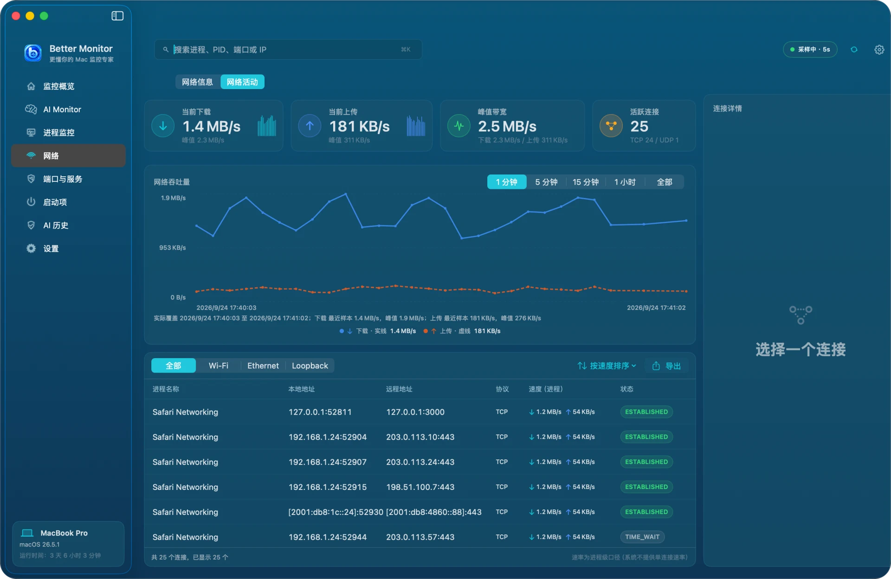

- 顶部：当前下载、当前上传、峰值带宽、活跃连接数（区分 TCP / UDP）；
- 网络吞吐量曲线：可切换 1 分钟、5 分钟、15 分钟、1 小时和全部。1 小时和全部使用本地历史，只保留上下行合计速率；
- 连接列表：按全部、Wi-Fi、Ethernet、Loopback 筛选，显示进程、本地地址、远程地址、协议、速度和 TCP 状态；可以按速度排序，也可以导出；
- 选中一条连接，右侧「连接详情」显示完整信息。

说明：macOS 不提供单条连接的速率，列表里的「速度」是该连接所属进程的整体速率。

## 端口与服务

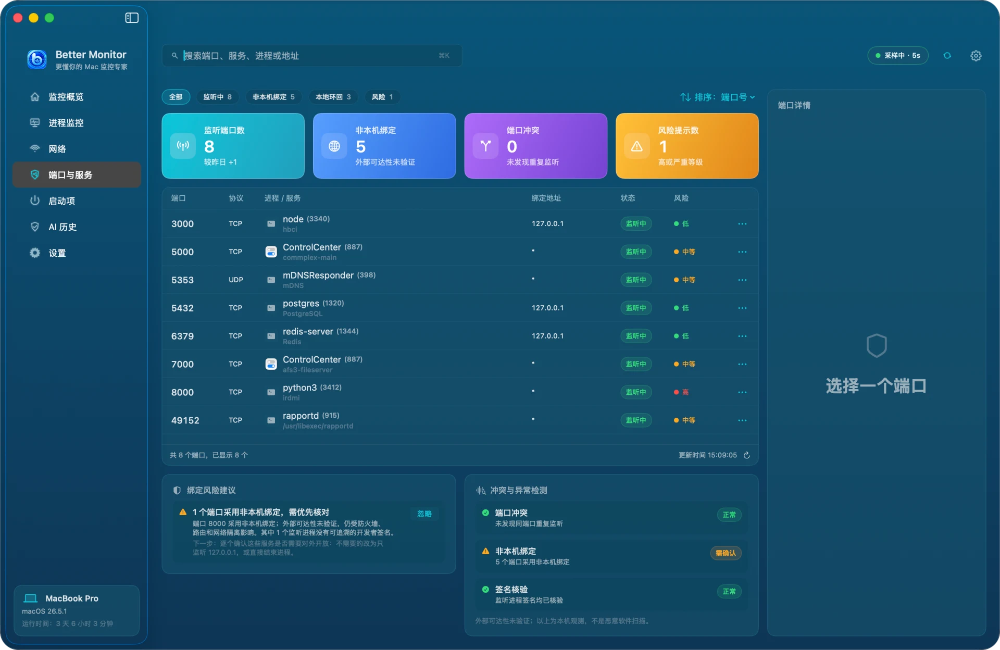

这一页回答「这台 Mac 正在监听哪些端口、归谁、有没有暴露在外」。

- 顶部筛选：全部、监听中、非本机绑定、本地环回、风险；
- 四张卡片：监听端口数（附较昨日变化）、非本机绑定、端口冲突、风险提示数；
- 列表：端口、协议、进程与服务名、绑定地址、状态、风险等级。点行尾的「⋯」可以复制端口信息、在 Finder 中显示可执行文件，或结束进程；
- 「绑定风险建议」解释为什么某个端口被标为风险，以及下一步怎么做（例如改为只监听 127.0.0.1）；
- 「冲突与异常检测」检查重复监听、非本机绑定和监听进程的签名。

绑定地址的含义：`127.0.0.1` 或 `::1` 表示只有本机能访问；`*`、`0.0.0.0` 或 `::` 表示监听所有网络接口。**非本机绑定只是需要核对的信号，不代表外部真的能访问**：防火墙、路由器和网络隔离都会影响可达性，Better Monitor 不做端口扫描，也不是安全审计工具。macOS 自带的 AirPlay 接收器（5000、7000 端口）等服务本来就会监听所有接口，通常无需处理。

## 启动项

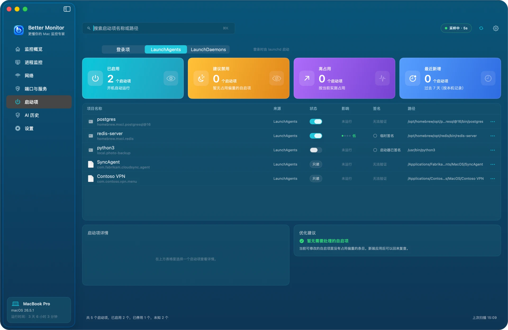

这一页汇总登录后会自动运行的程序，分三个分段：

- **登录项**：「系统设置 › 通用 › 登录项与扩展」里「登录时打开」的 App。由 macOS 管理，这里只读，点「打开系统登录项」去系统设置修改；
- **LaunchAgents**：用户登录时由 launchd 启动。位于你自己的 `~/Library/LaunchAgents` 中的条目可以直接在这里启用或停用；`/Library/LaunchAgents` 里的系统级条目只读；
- **LaunchDaemons**：开机时以系统身份启动，只读。

四张卡片：已启用、建议禁用、高占用、最近新增（按本机首次看到的时间统计）。列表里的「影响」是该条目对应进程**当前**的资源占用，不是开机耗时，停用后也不保证一定节省资源。如果同一个程序运行着多个进程（例如 PostgreSQL），无法确定归属，会显示「未运行」。签名列会标出签名有效、临时签名、无法验证等状态；由脚本解释器（python、node、bash 等）启动的条目会标为「启动器已签名」，提醒你真正运行的是一段脚本。

## AI 进程总结与 AI 历史

AI 功能是可选的，不配置也不影响任何监控功能。

**配置**：打开「设置 › 权限与集成 › AI 服务 › 管理」，添加一组 API 配置：

- 接口类型：Anthropic，或者兼容 OpenAI Chat Completions 的服务；
- 名称、Endpoint（必须是 HTTPS）、模型；
- API Key 保存在 macOS 钥匙串中；编辑时留空表示保留原值。

可以保存多组配置，并选择其中一组「设为当前配置」。

**生成总结**：打开任意进程的详情，在「AI 进程总结」卡片里点生成。第一次使用会弹出「将进程详情发送给 AI 服务？」，说明将发送的内容：当前进程的完整路径、PID、资源与网络观测，以及打开文件的路径。**不会发送文件内容、其他进程的信息或 API Key。** 点「同意并生成」后才会发出请求。

总结出来后，点「查看更多与追问」可以就这个进程继续提问，也可以「重新生成」。AI 的结论只是辅助解释，不是安全或性能诊断，最终判断仍需你自己做。

**AI 历史**：

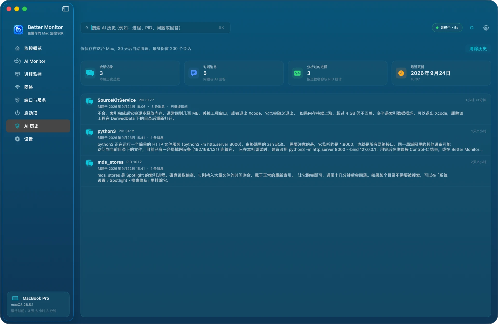

所有总结和追问都按进程保存在本机，保留 30 天、最多 200 个会话。可以搜索进程名、PID、问题或回答，也可以一键「清除历史」。清除只删除本机记录，已经发给 AI 服务商的数据以服务商自己的保留和训练政策为准。

## 菜单栏

Better Monitor 运行时，菜单栏会有它的图标。点击图标弹出实时面板：CPU、内存、存储、电池和网络的当前数值与近期曲线，以及「打开 Better Monitor」「立即刷新」等按钮。

默认菜单栏只显示图标。在「设置 › 菜单栏」打开「菜单栏实时数据」后，可以选择在菜单栏里直接显示 CPU、内存、网络速率、温度或磁盘活动，并在紧凑（只显示第一个可用指标）和详细两种样式之间切换，下方有预览。

## 设置

设置分为七个分类：

**常规**：采样间隔（1、2、5、10 秒）、进程列表刷新频率、后台数据保留（1、3、7 天）、后台实时采样开关；温度单位、网络速率单位、百分比精度；恢复默认设置、导出诊断报告。

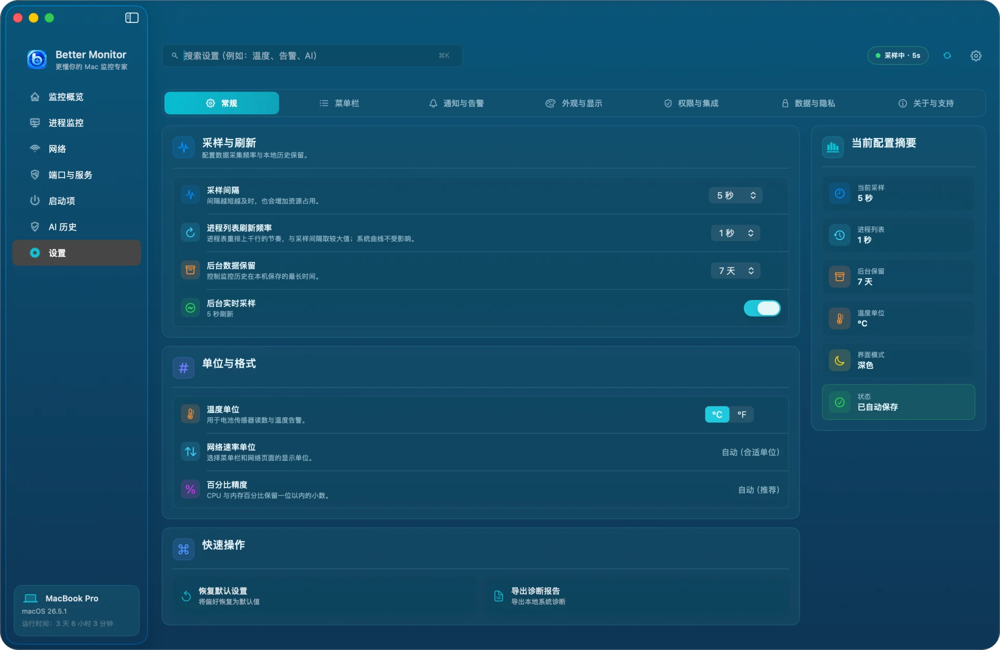

**菜单栏**：见上一节。

**通知与告警**：系统通知总开关；高 CPU 使用率、高内存使用率、电池温度三类告警的阈值；通知方式（横幅、声音、忽略）；静默时段。告警只在条件持续满足时才会触发，避免瞬时波动误报。

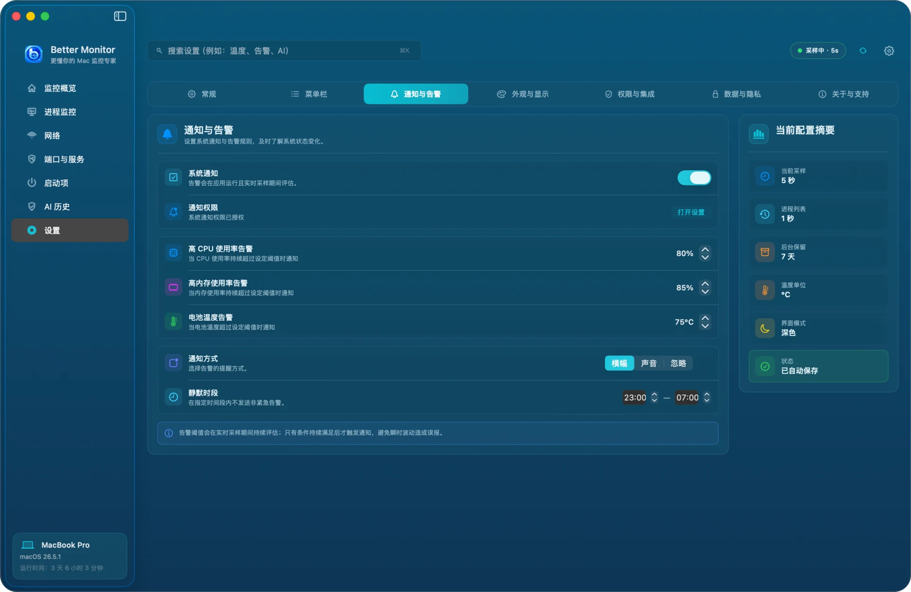

**外观与显示**：界面语言（简体中文、English、日本語、한국어，或跟随系统，切换后立即生效）；外观模式（跟随系统、浅色、深色）；强调色；图表动画效果；数字格式。

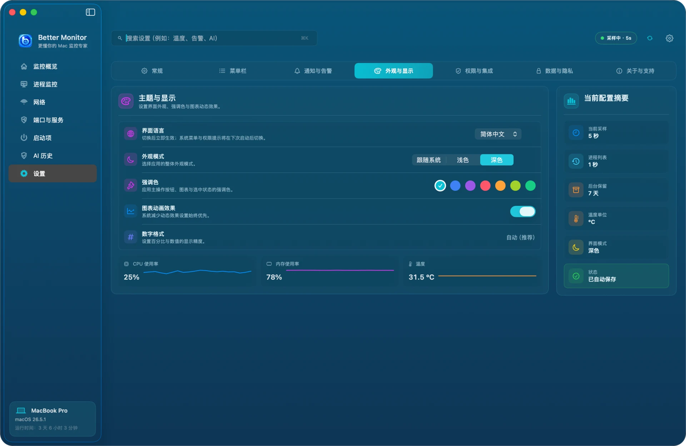

**权限与集成**：各项系统权限的状态和授权入口；启动时打开；快捷指令支持开关；AI 服务管理；导出诊断报告。

**数据与隐私**：本地存储状态；自动清理过期数据；导出脱敏后的诊断报告；清除本地数据（永久删除监控历史和本地 AI 对话）；恢复默认设置（只恢复偏好，不删除历史、AI 数据或 API Key）。

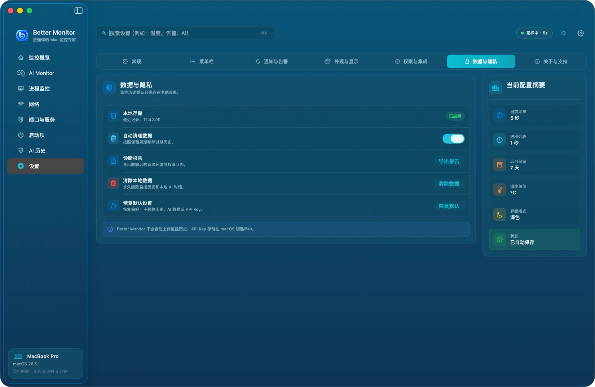

**关于与支持**：应用版本，以及帮助、隐私政策、使用条款和支持中心的入口。

## 快捷指令

Better Monitor 为「快捷指令」App 提供三个操作：

- 打开 Better Monitor
- 暂停 Better Monitor 采样
- 恢复 Better Monitor 采样

例如可以在专注模式或演示前自动暂停采样。如果不希望快捷指令控制采样，在「设置 › 权限与集成」关闭「快捷指令支持」。

## 隐私与本地数据

- 监控数据只在本机读取和保存，不需要账号，也不会自动上传。
- 只有两种情况会联网：你手动查询公网 IP；你主动请求 AI 总结或追问（发给你自己配置的服务商）。
- 数据位置：
  - 监控历史与 AI 对话：`~/Library/Application Support/net.better.mac.monitor/`
  - 偏好设置：`~/Library/Preferences/net.better.mac.monitor.plist`
  - AI API Key：钥匙串中的 `net.better.mac.monitor.ai` 条目
- 在「设置 › 数据与隐私」可以清除本地数据；在 AI 服务里删除配置会同时删除对应的 API Key。

完整条款见[隐私政策](https://bettermac.net/privacy/)。

## 常见问题

**Wi-Fi 名称显示不可用**
打开「系统设置 › 隐私与安全性 › 定位服务」，允许 Better Monitor，然后回到网络页刷新。

**「登录项」分段读不到内容**
这一分段通过 System Events 读取清单。打开「系统设置 › 隐私与安全性 › 自动化」，允许 Better Monitor 控制 System Events，然后在启动项页点刷新。

**结束进程失败**
系统进程、属于其他用户的进程和受系统完整性保护的进程无法由普通应用结束。Better Monitor 在发送信号前还会重新核对进程身份：如果 PID 已被别的进程复用，操作会被拒绝，以免误伤。

**端口列表里看不到所属进程，或者某些数值显示为「—」**
属于其他用户或 root 的进程，macOS 可能不开放细节。「—」表示当前读不到，而不是 0。

**曲线是空的，或者一直显示「等待采样」**
检查顶栏是否处于暂停状态（⌘. 可以恢复），以及「设置 › 常规 › 后台实时采样」是否打开。

**Better Monitor 自己占用多少资源？**
进程列表和网络清单只在窗口可见并需要时才刷新；窗口隐藏后只保留轻量的系统指标采样。可以在「设置 › 常规」调大采样间隔进一步降低开销。

仍有问题可以访问[支持中心](https://bettermac.net/support/?product=better-monitor)或[提交 Issue](https://github.com/BetterMacNet/better-monitor/issues/new?template=bug_report.md)。

## 卸载

用 Homebrew 安装的：

```bash
brew uninstall --cask better-monitor
# 连同本地数据一起删除
brew uninstall --zap --cask better-monitor
```

手动安装的：先退出 Better Monitor，把「应用程序」里的 `Better Monitor.app` 移到废纸篓；如需删除数据，再删除上文「隐私与本地数据」列出的目录和偏好文件。钥匙串里的 API Key 不会被 zap 删除，请先在 App 内删除 AI 配置，或者在「钥匙串访问」中删除 `net.better.mac.monitor.ai`。
